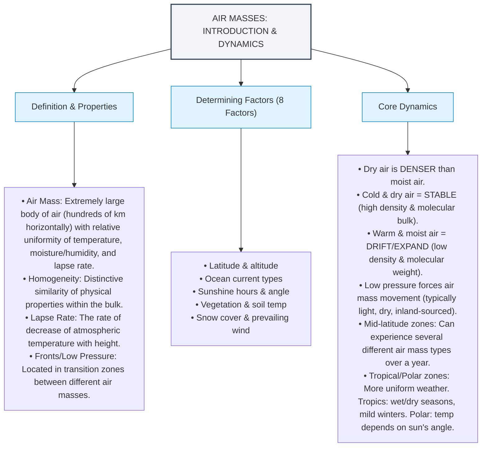
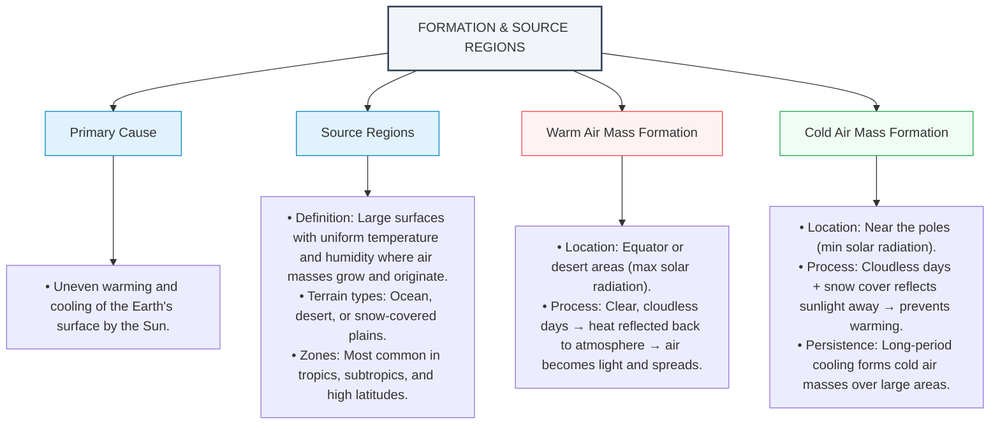
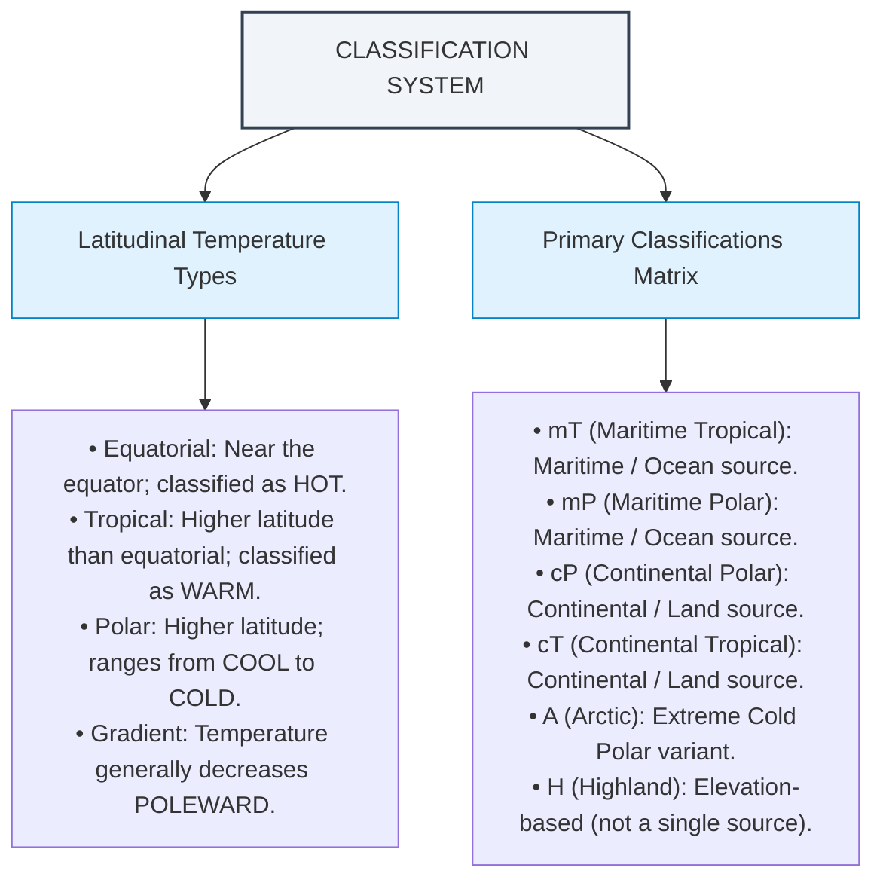
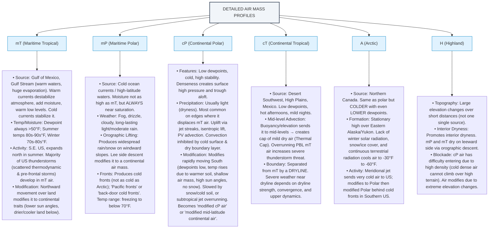

# Air Mass Deep Dive - Visual Flowcharts

---

## 2. Formation & Source Regions of Air Masses

---

## 3. Latitudinal Classification & Abbreviation Matrix

---

## 4. Detailed Profiles of Primary Air Masses

