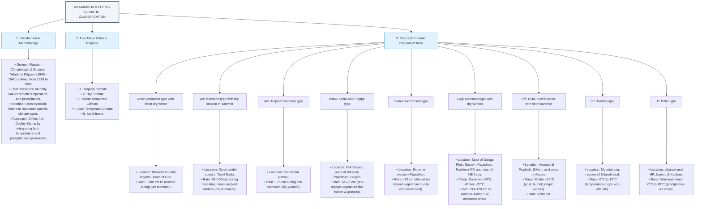

# Climate Zones in India According to Koeppen's Classification - Visual Flowcharts

```mermaid
flowchart TD
    Title["WLADIMIR KOEPPEN'S CLIMATIC CLASSIFICATION"]
    Title --> Intro["1. Introduction & Methodology"]
    Title --> Regions["2. Five Major Climate Regions"]
    Title --> SubRegions["3. Nine Sub-Climate Regions of India"]

    Intro --> Intro_Bullets["• German-Russian Climatologist & Botanist Wladimir Köppen (1846–1940); refined from 1918 to 1936.<br>• Data: Based on monthly values of both temperature and precipitation.<br>• Notation: Uses symbolic letters to represent specific climate types.<br>• Approach: Differs from Dudley Stamp by integrating both temperature and precipitation dynamically."]

    Regions --> Regions_Bullets["• 1. Tropical Climate<br>• 2. Dry Climate<br>• 3. Warm Temperate Climate<br>• 4. Cold Temperate Climate<br>• 5. Ice Climate"]

    SubRegions --> Amw["Amw: Monsoon type with short dry winter"]
    SubRegions --> As["As: Monsoon type with dry season in summer"]
    SubRegions --> Aw["Aw: Tropical Savanna type"]
    SubRegions --> Bshw["Bshw: Semi-Arid Steppe type"]
    SubRegions --> Bwhw["Bwhw: Hot Desert type"]
    SubRegions --> Cwg["Cwg: Monsoon type with dry winters"]
    SubRegions --> Dfc["Dfc: Cold, humid winter with short summer"]
    SubRegions --> Et["Et: Tundra type"]
    SubRegions --> E["E: Polar type"]

    Amw --> Amw_Bullets["• Location: Western coastal regions, south of Goa.<br>• Rain: ~300 cm in summer during SW monsoon."]
    As --> As_Bullets["• Location: Coromandel coast of Tamil Nadu.<br>• Rain: 75–100 cm during retreating monsoon (wet winters, dry summers)."]
    Aw --> Aw_Bullets["• Location: Peninsular plateau.<br>• Rain: ~75 cm during SW monsoon (dry winters)."]
    Bshw --> Bshw_Bullets["• Location: NW Gujarat, parts of Western Rajasthan, Punjab.<br>• Rain: 12–25 cm (arid-steppe vegetation like fodder & grasses)."]
    Bwhw --> Bwhw_Bullets["• Location: Extreme western Rajasthan.<br>• Rain: <12 cm (almost no natural vegetation due to excessive heat)."]
    Cwg --> Cwg_Bullets["• Location: Most of Ganga Plain, Eastern Rajasthan, Northern MP, and most of NE India.<br>• Temp: Summer ~40°C, Winter ~27°C.<br>• Rain: 100–120 cm in summer during SW monsoon onset."]
    Dfc --> Dfc_Bullets["• Location: Arunachal Pradesh, Sikkim, and parts of Assam.<br>• Temp: Winter ~10°C (cold, humid, longer winters).<br>• Rain: >200 cm."]
    Et --> Et_Bullets["• Location: Mountainous regions of Uttarakhand.<br>• Temp: 0°C to 10°C (temperature drops with altitude)."]
    E --> E_Bullets["• Location: Uttarakhand, HP, Jammu & Kashmir.<br>• Temp: Warmest month 0°C to 10°C (precipitation as snow)."]

    style Title fill:#f1f5f9,stroke:#334155,stroke-width:2px
    style Intro fill:#e0f2fe,stroke:#0284c7,stroke-width:1px
    style Regions fill:#e0f2fe,stroke:#0284c7,stroke-width:1px
    style SubRegions fill:#e0f2fe,stroke:#0284c7,stroke-width:1px
```
