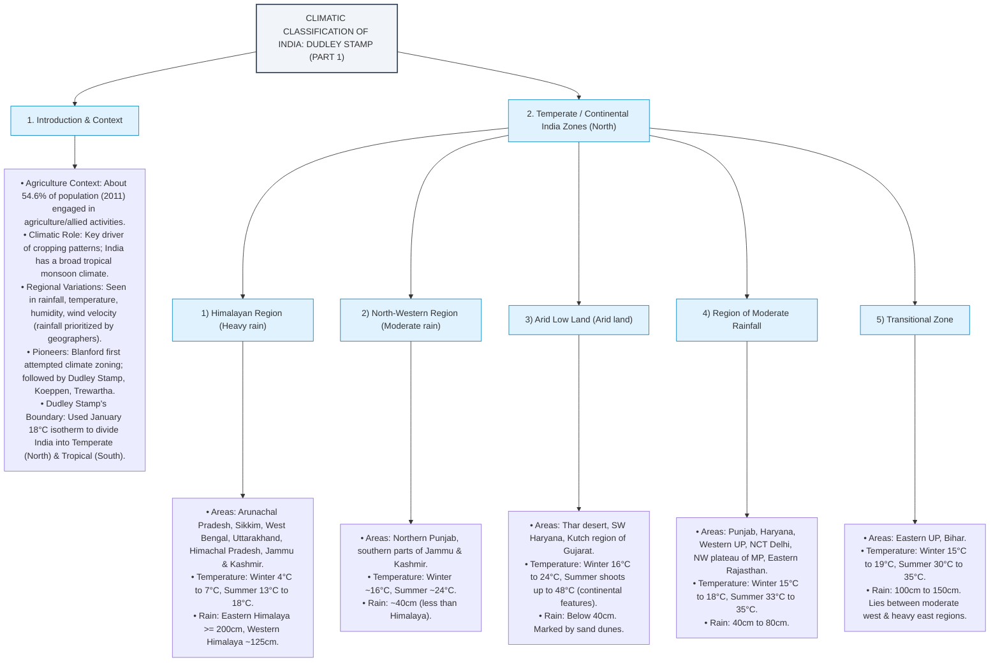
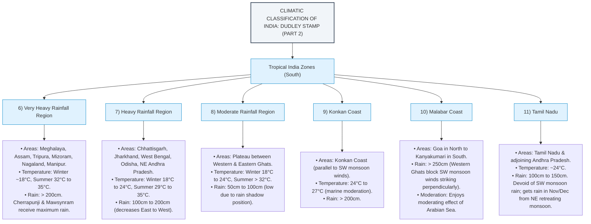

# Climatic Classification of India - Visual Flowcharts

```mermaid
flowchart TD
    Title["CLIMATIC CLASSIFICATION OF INDIA: DUDLEY STAMP (PART 1)"]
    Title --> Intro["1. Introduction & Context"]
    Intro --> Intro_Bullets["• Agriculture Context: About 54.6% of population (2011) engaged in agriculture/allied activities.<br>• Climatic Role: Key driver of cropping patterns; India has a broad tropical monsoon climate.<br>• Regional Variations: Seen in rainfall, temperature, humidity, wind velocity (rainfall prioritized by geographers).<br>• Pioneers: Blanford first attempted climate zoning; followed by Dudley Stamp, Koeppen, Trewartha.<br>• Dudley Stamp's Boundary: Used January 18°C isotherm to divide India into Temperate (North) & Tropical (South)."]

    Title --> Temp["2. Temperate / Continental India Zones (North)"]
    Temp --> Z1["1) Himalayan Region (Heavy rain)"]
    Temp --> Z2["2) North-Western Region (Moderate rain)"]
    Temp --> Z3["3) Arid Low Land (Arid land)"]
    Temp --> Z4["4) Region of Moderate Rainfall"]
    Temp --> Z5["5) Transitional Zone"]

    Z1 --> Z1_Bullets["• Areas: Arunachal Pradesh, Sikkim, West Bengal, Uttarakhand, Himachal Pradesh, Jammu & Kashmir.<br>• Temperature: Winter 4°C to 7°C, Summer 13°C to 18°C.<br>• Rain: Eastern Himalaya >= 200cm, Western Himalaya ~125cm."]
    Z2 --> Z2_Bullets["• Areas: Northern Punjab, southern parts of Jammu & Kashmir.<br>• Temperature: Winter ~16°C, Summer ~24°C.<br>• Rain: ~40cm (less than Himalaya)."]
    Z3 --> Z3_Bullets["• Areas: Thar desert, SW Haryana, Kutch region of Gujarat.<br>• Temperature: Winter 16°C to 24°C, Summer shoots up to 48°C (continental features).<br>• Rain: Below 40cm. Marked by sand dunes."]
    Z4 --> Z4_Bullets["• Areas: Punjab, Haryana, Western UP, NCT Delhi, NW plateau of MP, Eastern Rajasthan.<br>• Temperature: Winter 15°C to 18°C, Summer 33°C to 35°C.<br>• Rain: 40cm to 80cm."]
    Z5 --> Z5_Bullets["• Areas: Eastern UP, Bihar.<br>• Temperature: Winter 15°C to 19°C, Summer 30°C to 35°C.<br>• Rain: 100cm to 150cm. Lies between moderate west & heavy east regions."]

    style Title fill:#f1f5f9,stroke:#334155,stroke-width:2px
    style Intro fill:#e0f2fe,stroke:#0284c7,stroke-width:1px
    style Temp fill:#e0f2fe,stroke:#0284c7,stroke-width:1px
    style Z1 fill:#e0f2fe,stroke:#0284c7,stroke-width:1px
    style Z2 fill:#e0f2fe,stroke:#0284c7,stroke-width:1px
    style Z3 fill:#e0f2fe,stroke:#0284c7,stroke-width:1px
    style Z4 fill:#e0f2fe,stroke:#0284c7,stroke-width:1px
    style Z5 fill:#e0f2fe,stroke:#0284c7,stroke-width:1px
```

---

## 2. Dudley Stamp's Climatic Classification (Part 2: South India)

```mermaid
flowchart TD
    Title["CLIMATIC CLASSIFICATION OF INDIA: DUDLEY STAMP (PART 2)"]
    Title --> Trop["Tropical India Zones (South)"]
    Trop --> Z6["6) Very Heavy Rainfall Region"]
    Trop --> Z7["7) Heavy Rainfall Region"]
    Trop --> Z8["8) Moderate Rainfall Region"]
    Trop --> Z9["9) Konkan Coast"]
    Trop --> Z10["10) Malabar Coast"]
    Trop --> Z11["11) Tamil Nadu"]

    Z6 --> Z6_Bullets["• Areas: Meghalaya, Assam, Tripura, Mizoram, Nagaland, Manipur.<br>• Temperature: Winter ~18°C, Summer 32°C to 35°C.<br>• Rain: > 200cm. Cherrapunji & Mawsynram receive maximum rain."]
    Z7 --> Z7_Bullets["• Areas: Chhattisgarh, Jharkhand, West Bengal, Odisha, NE Andhra Pradesh.<br>• Temperature: Winter 18°C to 24°C, Summer 29°C to 35°C.<br>• Rain: 100cm to 200cm (decreases East to West)."]
    Z8 --> Z8_Bullets["• Areas: Plateau between Western & Eastern Ghats.<br>• Temperature: Winter 18°C to 24°C, Summer > 32°C.<br>• Rain: 50cm to 100cm (low due to rain shadow position)."]
    Z9 --> Z9_Bullets["• Areas: Konkan Coast (parallel to SW monsoon winds).<br>• Temperature: 24°C to 27°C (marine moderation).<br>• Rain: > 200cm."]
    Z10 --> Z10_Bullets["• Areas: Goa in North to Kanyakumari in South.<br>• Rain: > 250cm (Western Ghats block SW monsoon winds striking perpendicularly).<br>• Moderation: Enjoys moderating effect of Arabian Sea."]
    Z11 --> Z11_Bullets["• Areas: Tamil Nadu & adjoining Andhra Pradesh.<br>• Temperature: ~24°C.<br>• Rain: 100cm to 150cm. Devoid of SW monsoon rain; gets rain in Nov/Dec from NE retreating monsoon."]

    style Title fill:#f1f5f9,stroke:#334155,stroke-width:2px
    style Trop fill:#e0f2fe,stroke:#0284c7,stroke-width:1px
    style Z6 fill:#e0f2fe,stroke:#0284c7,stroke-width:1px
    style Z7 fill:#e0f2fe,stroke:#0284c7,stroke-width:1px
    style Z8 fill:#e0f2fe,stroke:#0284c7,stroke-width:1px
    style Z9 fill:#e0f2fe,stroke:#0284c7,stroke-width:1px
    style Z10 fill:#e0f2fe,stroke:#0284c7,stroke-width:1px
    style Z11 fill:#e0f2fe,stroke:#0284c7,stroke-width:1px
```
