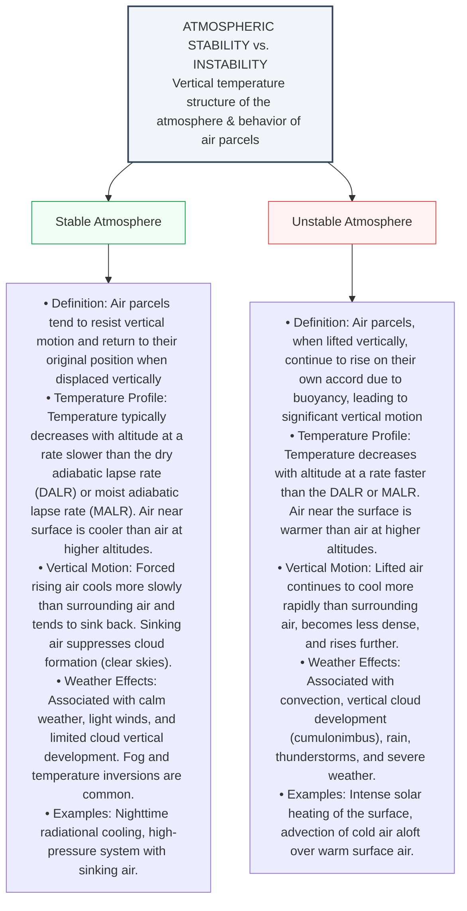

# Difference Between Stability and Instability - Visual Flowcharts

```mermaid
flowchart TD
    Title["ATMOSPHERIC STABILITY vs. INSTABILITY<br>Vertical temperature structure of the atmosphere & behavior of air parcels"]
    Title --> B["Stable Atmosphere"]
    Title --> C["Unstable Atmosphere"]

    B --> B_Bullets["• Definition: Air parcels tend to resist vertical motion and return to their original position when displaced vertically<br>• Temperature Profile: Temperature typically decreases with altitude at a rate slower than the dry adiabatic lapse rate (DALR) or moist adiabatic lapse rate (MALR). Air near surface is cooler than air at higher altitudes.<br>• Vertical Motion: Forced rising air cools more slowly than surrounding air and tends to sink back. Sinking air suppresses cloud formation (clear skies).<br>• Weather Effects: Associated with calm weather, light winds, and limited cloud vertical development. Fog and temperature inversions are common.<br>• Examples: Nighttime radiational cooling, high-pressure system with sinking air."]
    
    C --> C_Bullets["• Definition: Air parcels, when lifted vertically, continue to rise on their own accord due to buoyancy, leading to significant vertical motion<br>• Temperature Profile: Temperature decreases with altitude at a rate faster than the DALR or MALR. Air near the surface is warmer than air at higher altitudes.<br>• Vertical Motion: Lifted air continues to cool more rapidly than surrounding air, becomes less dense, and rises further.<br>• Weather Effects: Associated with convection, vertical cloud development (cumulonimbus), rain, thunderstorms, and severe weather.<br>• Examples: Intense solar heating of the surface, advection of cold air aloft over warm surface air."]

    style Title fill:#f1f5f9,stroke:#334155,stroke-width:2px
    style B fill:#f0fdf4,stroke:#16a34a,stroke-width:1px
    style C fill:#fef2f2,stroke:#ef4444,stroke-width:1px
```
