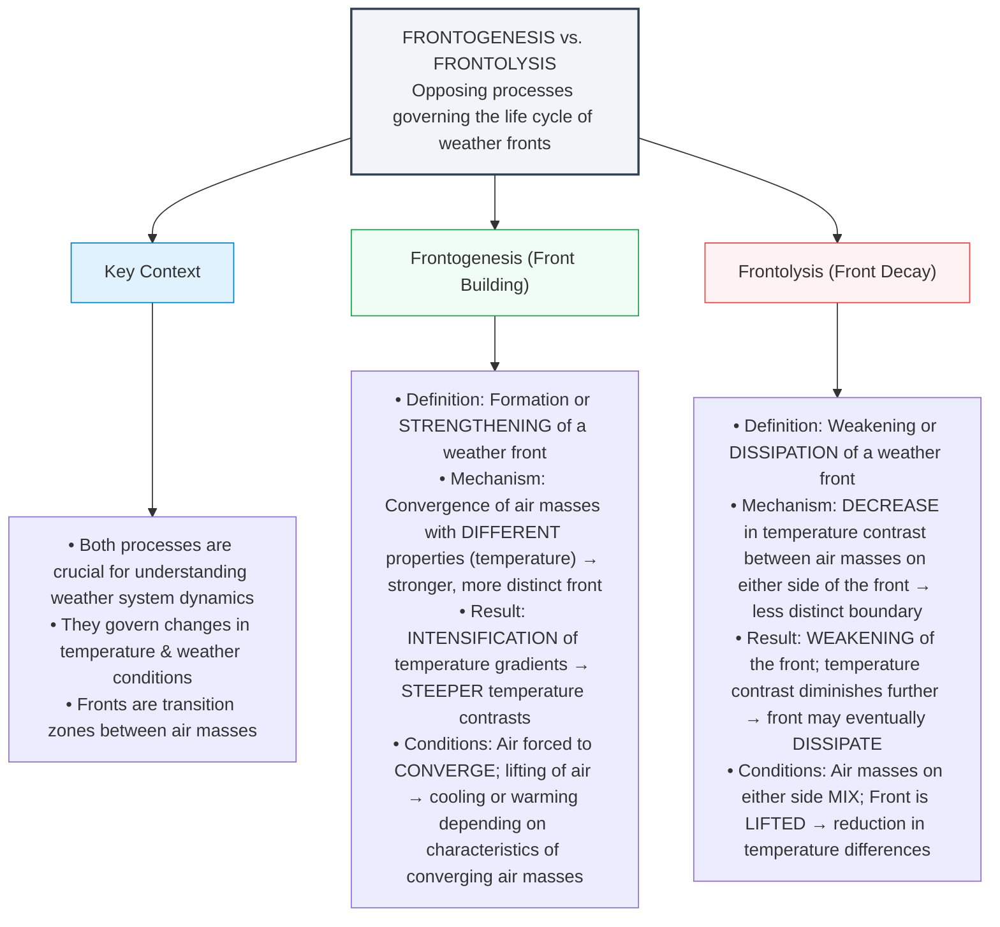

# Differences between Frontogenesis and Frontolysis - Visual Flowcharts

```mermaid
flowchart TD
    Title["FRONTOGENESIS vs. FRONTOLYSIS<br>Opposing processes governing the life cycle of weather fronts"]
    Title --> Intro["Key Context"]
    Title --> B["Frontogenesis (Front Building)"]
    Title --> C["Frontolysis (Front Decay)"]

    Intro --> Intro_Bullets["• Both processes are crucial for understanding weather system dynamics<br>• They govern changes in temperature & weather conditions<br>• Fronts are transition zones between air masses"]

    B --> B_Bullets["• Definition: Formation or STRENGTHENING of a weather front<br>• Mechanism: Convergence of air masses with DIFFERENT properties (temperature) → stronger, more distinct front<br>• Result: INTENSIFICATION of temperature gradients → STEEPER temperature contrasts<br>• Conditions: Air forced to CONVERGE; lifting of air → cooling or warming depending on characteristics of converging air masses"]
    
    C --> C_Bullets["• Definition: Weakening or DISSIPATION of a weather front<br>• Mechanism: DECREASE in temperature contrast between air masses on either side of the front → less distinct boundary<br>• Result: WEAKENING of the front; temperature contrast diminishes further → front may eventually DISSIPATE<br>• Conditions: Air masses on either side MIX; Front is LIFTED → reduction in temperature differences"]

    style Title fill:#f1f5f9,stroke:#334155,stroke-width:2px
    style Intro fill:#e0f2fe,stroke:#0284c7,stroke-width:1px
    style B fill:#f0fdf4,stroke:#16a34a,stroke-width:1px
    style C fill:#fef2f2,stroke:#ef4444,stroke-width:1px
```
