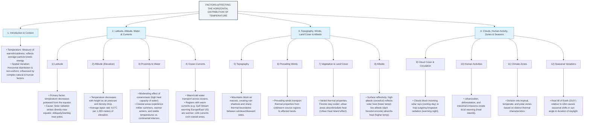

# Factors Affecting the Horizontal Distribution of Temperature - Visual Flowcharts

```mermaid
flowchart TD
    Title["FACTORS AFFECTING THE HORIZONTAL DISTRIBUTION OF TEMPERATURE"]
    Title --> Intro["1. Introduction & Context"]
    Title --> Factors1["2. Latitude, Altitude, Water & Currents"]
    Title --> Factors2["3. Topography, Winds, Land Cover & Albedo"]
    Title --> Factors3["4. Clouds, Human Activity, Zones & Seasons"]

    Intro --> Intro_Bullets["• Temperature: Measure of warmth/coldness; reflects average particle kinetic energy.<br>• Spatial Variation: Horizontal distribution is non-uniform; influenced by complex natural & human factors."]

    Factors1 --> Lat["1) Latitude"]
    Factors1 --> Alt["2) Altitude (Elevation)"]
    Factors1 --> Prox["3) Proximity to Water"]
    Factors1 --> Curr["4) Ocean Currents"]

    Lat --> Lat_Bullets["• Primary factor; temperature decreases poleward from the equator.<br>• Cause: Solar radiation strikes directly near equator, obliquely/slanting near poles."]
    Alt --> Alt_Bullets["• Temperature decreases with height as air pressure and density drop.<br>• Average lapse rate: 6.5°C per 1,000 meters of elevation."]
    Prox --> Prox_Bullets["• Moderating effect of oceans/seas (high heat capacity of water).<br>• Coastal areas experience milder summers, warmer winters, and stable temperatures vs. continental interiors."]
    Curr --> Curr_Bullets["• Warm/cold water transport across oceans.<br>• Regions with warm currents (e.g. Gulf Stream warming Europe/East US) are warmer; cold currents cool coastal areas."]

    Factors2 --> Topo["5) Topography"]
    Factors2 --> Winds["6) Prevailing Winds"]
    Factors2 --> Veg["7) Vegetation & Land Cover"]
    Factors2 --> Alb["8) Albedo"]

    Topo --> Topo_Bullets["• Mountains block air masses, creating rain shadows and sharp thermal boundaries between windward/leeward sides."]
    Winds --> Winds_Bullets["• Prevailing winds transport thermal properties from cold/warm source regions to affected lands."]
    Veg --> Veg_Bullets["• Varied thermal properties. Forests stay cooler; urban areas absorb/radiate heat (Urban Heat Island effect)."]
    Alb --> Alb_Bullets["• Surface reflectivity: high albedo (snow/ice) reflects solar heat (lower temp); low albedo (dark forests/concrete) absorbs heat (higher temp)."]

    Factors3 --> Clouds["9) Cloud Cover & Circulation"]
    Factors3 --> Human["10) Human Activities"]
    Factors3 --> Zones["11) Climate Zones"]
    Factors3 --> Seasons["12) Seasonal Variations"]

    Clouds --> Clouds_Bullets["• Clouds block incoming solar rays (cooling day) or trap outgoing longwave radiation (warming night)."]
    Human --> Human_Bullets["• Urbanization, deforestation, and industrial emissions create local warming (heat islands)."]
    Zones --> Zones_Bullets["• Division into tropical, temperate, and polar zones based on distinct thermal characteristics."]
    Seasons --> Seasons_Bullets["• Axial tilt of Earth (23.5°) relative to orbit causes seasonal shifts in sun angle & duration of daylight."]

    style Title fill:#f1f5f9,stroke:#334155,stroke-width:2px
    style Intro fill:#e0f2fe,stroke:#0284c7,stroke-width:1px
    style Factors1 fill:#e0f2fe,stroke:#0284c7,stroke-width:1px
    style Factors2 fill:#e0f2fe,stroke:#0284c7,stroke-width:1px
    style Factors3 fill:#e0f2fe,stroke:#0284c7,stroke-width:1px
```
