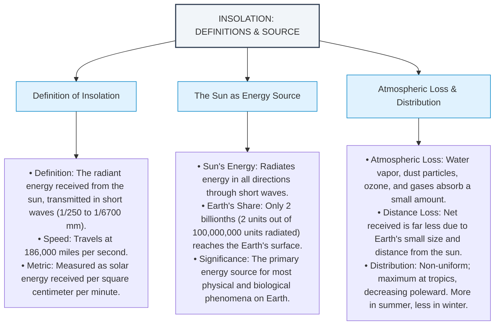
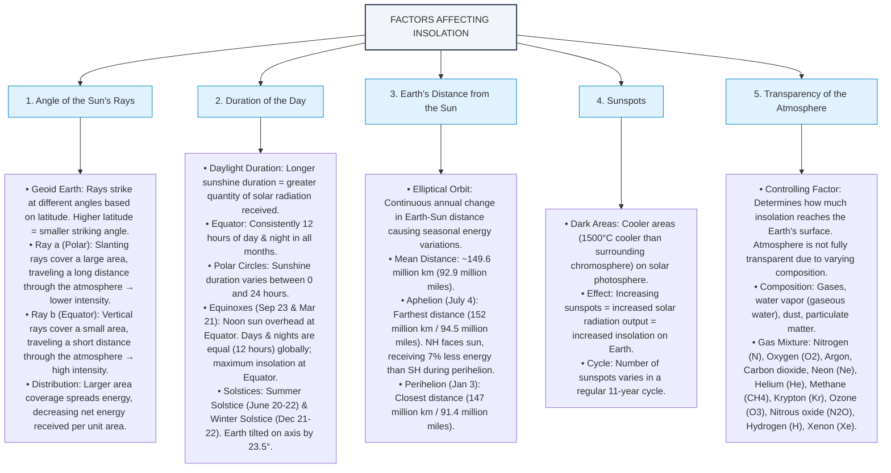

# Insolation - Visual Flowcharts

```mermaid
flowchart TD
    Title["INSOLATION: DEFINITIONS & SOURCE"]
    Title --> Def["Definition of Insolation"]
    Title --> Source["The Sun as Energy Source"]
    Title --> Dist["Atmospheric Loss & Distribution"]

    Def --> Def_Bullets["• Definition: The radiant energy received from the sun, transmitted in short waves (1/250 to 1/6700 mm).<br>• Speed: Travels at 186,000 miles per second.<br>• Metric: Measured as solar energy received per square centimeter per minute."]

    Source --> Source_Bullets["• Sun's Energy: Radiates energy in all directions through short waves.<br>• Earth's Share: Only 2 billionths (2 units out of 100,000,000 units radiated) reaches the Earth's surface.<br>• Significance: The primary energy source for most physical and biological phenomena on Earth."]

    Dist --> Dist_Bullets["• Atmospheric Loss: Water vapor, dust particles, ozone, and gases absorb a small amount.<br>• Distance Loss: Net received is far less due to Earth's small size and distance from the sun.<br>• Distribution: Non-uniform; maximum at tropics, decreasing poleward. More in summer, less in winter."]

    style Title fill:#f1f5f9,stroke:#334155,stroke-width:2px
    style Def fill:#e0f2fe,stroke:#0284c7,stroke-width:1px
    style Source fill:#e0f2fe,stroke:#0284c7,stroke-width:1px
    style Dist fill:#e0f2fe,stroke:#0284c7,stroke-width:1px
```

---

## 2. Factors Affecting Insolation

```mermaid
flowchart TD
    Title["FACTORS AFFECTING INSOLATION"]
    Title --> Angle["1. Angle of the Sun's Rays"]
    Title --> DayLength["2. Duration of the Day"]
    Title --> Distance["3. Earth's Distance from the Sun"]
    Title --> Sunspots["4. Sunspots"]
    Title --> Transp["5. Transparency of the Atmosphere"]

    Angle --> Angle_Bullets["• Geoid Earth: Rays strike at different angles based on latitude. Higher latitude = smaller striking angle.<br>• Ray a (Polar): Slanting rays cover a large area, traveling a long distance through the atmosphere → lower intensity.<br>• Ray b (Equator): Vertical rays cover a small area, traveling a short distance through the atmosphere → high intensity.<br>• Distribution: Larger area coverage spreads energy, decreasing net energy received per unit area."]

    DayLength --> DayLength_Bullets["• Daylight Duration: Longer sunshine duration = greater quantity of solar radiation received.<br>• Equator: Consistently 12 hours of day & night in all months.<br>• Polar Circles: Sunshine duration varies between 0 and 24 hours.<br>• Equinoxes (Sep 23 & Mar 21): Noon sun overhead at Equator. Days & nights are equal (12 hours) globally; maximum insolation at Equator.<br>• Solstices: Summer Solstice (June 20-22) & Winter Solstice (Dec 21-22). Earth tilted on axis by 23.5°."]

    Distance --> Distance_Bullets["• Elliptical Orbit: Continuous annual change in Earth-Sun distance causing seasonal energy variations.<br>• Mean Distance: ~149.6 million km (92.9 million miles).<br>• Aphelion (July 4): Farthest distance (152 million km / 94.5 million miles). NH faces sun, receiving 7% less energy than SH during perihelion.<br>• Perihelion (Jan 3): Closest distance (147 million km / 91.4 million miles)."]

    Sunspots --> Sunspots_Bullets["• Dark Areas: Cooler areas (1500°C cooler than surrounding chromosphere) on solar photosphere.<br>• Effect: Increasing sunspots = increased solar radiation output = increased insolation on Earth.<br>• Cycle: Number of sunspots varies in a regular 11-year cycle."]

    Transp --> Transp_Bullets["• Controlling Factor: Determines how much insolation reaches the Earth's surface. Atmosphere is not fully transparent due to varying composition.<br>• Composition: Gases, water vapor (gaseous water), dust, particulate matter.<br>• Gas Mixture: Nitrogen (N), Oxygen (O2), Argon, Carbon dioxide, Neon (Ne), Helium (He), Methane (CH4), Krypton (Kr), Ozone (O3), Nitrous oxide (N2O), Hydrogen (H), Xenon (Xe)."]

    style Title fill:#f1f5f9,stroke:#334155,stroke-width:2px
    style Angle fill:#e0f2fe,stroke:#0284c7,stroke-width:1px
    style DayLength fill:#e0f2fe,stroke:#0284c7,stroke-width:1px
    style Distance fill:#e0f2fe,stroke:#0284c7,stroke-width:1px
    style Sunspots fill:#e0f2fe,stroke:#0284c7,stroke-width:1px
    style Transp fill:#e0f2fe,stroke:#0284c7,stroke-width:1px
```
