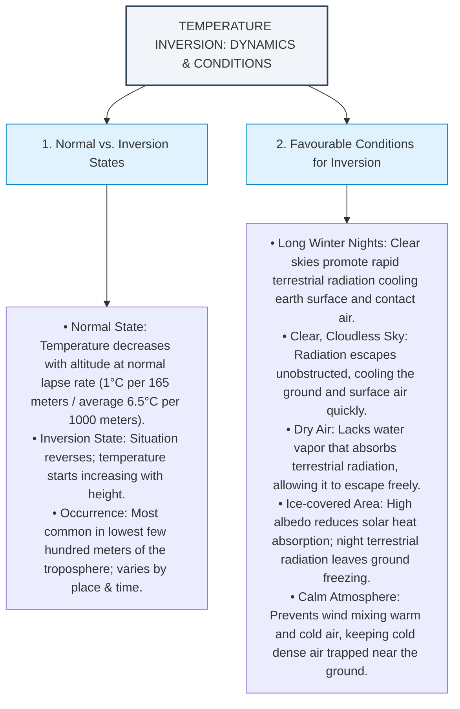

# Inversion of Temperature - Visual Flowcharts



---

## 2. Types of Temperature Inversion

```mermaid
flowchart TD
    Title["TYPES OF TEMPERATURE INVERSION"]
    Title --> Surface["A. Surface Inversions (Ground-level)"]
    Title --> UpperAir["B. Upper-Air Inversions (Subsidence)"]

    Surface --> S1["1) Radiational Inversion"]
    Surface --> S2["2) Advection Inversion"]
    Surface --> S3["3) Drainage Inversion"]

    S1 --> S1_Bullets["• Cause: Long winter nights with rapid longwave radiation emission.<br>• Process: Conduction cools air immediately above cold ground.<br>• Timing: Occurs in winter (short daylight, long nights) and is highly prevalent in high latitudes."]
    
    S2 --> S2_Bullets["• Cause: Horizontal inflow of cold air (e.g., cool marine air blowing onto land).<br>• Features: Short-lived (typically overnight) and shallow.<br>• Occurrence: Can happen anytime of year depending on marine/land gradients."]
    
    S3 --> S3_Bullets["• Cause: Cool air slides down mountain slopes into valleys due to gravity.<br>• Process: Cold dense air pools at valley floor, displacing warmer air upward.<br>• Term: Also called cold-air drainage inversion; common in mid-latitude winter valleys."]

    UpperAir --> UA_Bullets["• Cause: Descending air from above (sinking air warms adiabatically by compression).<br>• Term: Also called subsidence inversions.<br>• Association: High-pressure conditions (subtropical latitudes or winter continental regions).<br>• Structure: Fairly deep (up to thousands of meters); base sits a few hundred meters aloft due to surface turbulence preventing descent to ground."]

    style Title fill:#f1f5f9,stroke:#334155,stroke-width:2px
    style Surface fill:#e0f2fe,stroke:#0284c7,stroke-width:1px
    style UpperAir fill:#e0f2fe,stroke:#0284c7,stroke-width:1px
    style S1 fill:#e0f2fe,stroke:#0284c7,stroke-width:1px
    style S2 fill:#e0f2fe,stroke:#0284c7,stroke-width:1px
    style S3 fill:#e0f2fe,stroke:#0284c7,stroke-width:1px

---

## 3. Consequences of Temperature Inversion

```mermaid
flowchart TD
    Title["CONSEQUENCES OF TEMPERATURE INVERSION"]
    Title --> C1["1. Visibility & Fog"]
    Title --> C2["2. Air Pollution & Smog"]
    Title --> C3["3. Weather & Climate Effects"]
    Title --> C4["4. Agricultural Impact"]

    C1 --> C1_Bullets["• Traps cooler, moisture-laden air near ground leading to condensation & fog.<br>• Drastically reduces visibility, impacting transport and daily operations."]
    C2 --> C2_Bullets["• Acts as atmospheric lid preventing upward mixing of air.<br>• Traps dust, smoke, and industrial emissions near the surface, forming smog."]
    C3 --> C3_Bullets["• Suppresses convection & cloud formation (clear skies above inversion).<br>• Slows wind speeds (stable layers), creating stagnant weather patterns.<br>• Suppresses vertical air movement, limiting rainfall & extending droughts.<br>• Suppresses thunderstorms; if inversion breaks, accumulated energy sparks severe storms."]
    C4 --> C4_Bullets["• Cool air near ground causes colder nights.<br>• Radiational cooling lowers surface temperatures, creating frost that damages crops."]

    style Title fill:#f1f5f9,stroke:#334155,stroke-width:2px
    style C1 fill:#f0fdf4,stroke:#16a34a,stroke-width:1px
    style C2 fill:#fef2f2,stroke:#ef4444,stroke-width:1px
    style C3 fill:#e0f2fe,stroke:#0284c7,stroke-width:1px
    style C4 fill:#fffbeb,stroke:#d97706,stroke-width:1px
```
```
