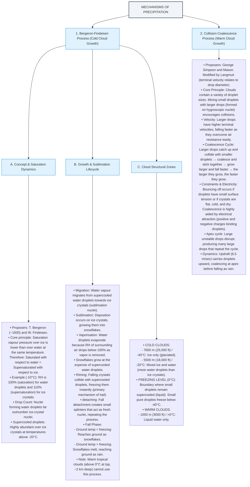
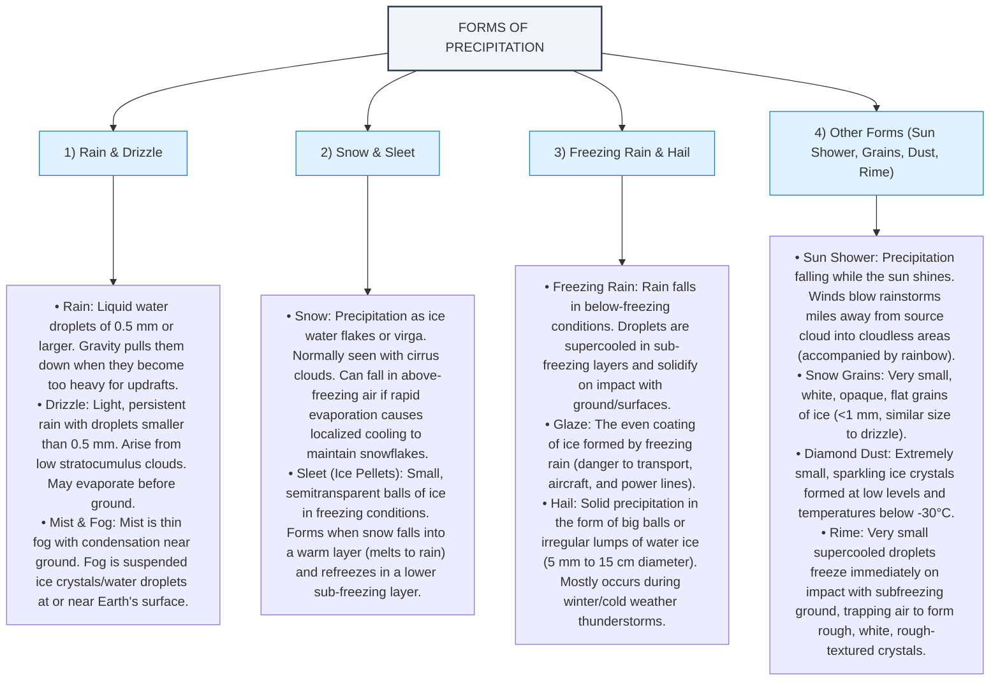

# Mechanism and Forms of Precipitation - Visual Flowcharts

```mermaid
flowchart TD
    Title["MECHANISMS OF PRECIPITATION"]
    Title --> BF["1. Bergeron-Findeisen Process (Cold Cloud Growth)"]
    Title --> CC["2. Collision-Coalescence Process (Warm Cloud Growth)"]

    BF --> BF_Intro["A. Concept & Saturation Dynamics"]
    BF --> BF_Process["B. Growth & Sublimation Lifecycle"]
    BF --> BF_Zones["C. Cloud Structural Zones"]

    BF_Intro --> BF_Intro_Bullets["• Proposers: T. Bergeron (~1930) and W. Findeisen.<br>• Core principle: Saturation vapour pressure over ice is lower than over water at the same temperature. Therefore: Saturated with respect to water = Supersaturated with respect to ice.<br>• Example (-10°C): RH is 100% (saturation) for water droplets and 110% (supersaturation) for ice crystals.<br>• Drop Count: Nuclei forming water droplets far outnumber ice-crystal nuclei.<br>• Supercooled droplets: Highly abundant over ice crystals at temperatures above -20°C."]

    BF_Process --> BF_Proc_Bullets["• Migration: Water vapour migrates from supercooled water droplets towards ice crystals (sublimation nuclei).<br>• Sublimation: Deposition occurs on ice crystals, growing them into snowflakes.<br>• Vaporisation: Water droplets evaporate because RH of surrounding air drops below 100% as vapor is removed.<br>• Snowflakes grow at the expense of supercooled water droplets.<br>• Riming: Falling crystals collide with supercooled droplets, freezing them instantly (primary mechanism of hail).<br>• detaching: Fall detachment creates small splinters that act as fresh nuclei, repeating the process.<br>• Fall Phase:<br>  - Ground temp < freezing: Reaches ground as snowflakes.<br>  - Ground temp > freezing: Snowflakes melt, reaching ground as rain.<br>• Note: Warm tropical clouds (above 0°C at top, ~2 km deep) cannot use this process."]

    BF_Zones --> BF_Zones_Bullets["• COLD CLOUDS:<br>  - 7600 m (25,000 ft) / -40°C: Ice only (glaciated).<br>  - 5500 m (18,000 ft) / -20°C: Mixed ice and water (more water droplets than ice crystals).<br>• FREEZING LEVEL (0°C): Boundary where small droplets remain supercooled (liquid). Small pure droplets freeze below -40°C.<br>• WARM CLOUDS:<br>  - 1000 m (3000 ft) / >0°C: Liquid water only."]

    CC --> CC_Bullets["• Proposers: George Simpson and Mason. Modified by Langmuir (terminal velocity relates to drop diameter).<br>• Core Principle: Clouds contain a variety of droplet sizes. Mixing small droplets with larger drops (formed on hygroscopic nuclei) encourages collisions.<br>• Velocity: Larger drops have higher terminal velocities, falling faster as they overcome air resistance easily.<br>• Coalescence Cycle: Larger drops catch up and collide with smaller droplets → coalesce and stick together → grow larger and fall faster → the larger they grow, the faster they grow.<br>• Constraints & Electricity: Bouncing off occurs if droplets have small surface tension or if crystals are flat, cold, and dry. Coalescence is highly aided by electrical attraction (positive and negative charges binding droplets).<br>• Apex cycle: Large unstable drops disrupt, producing many large drops that repeat the cycle.<br>• Dynamics: Updraft (6.5 m/sec) carries droplets upward, coalescing at apex before falling as rain."]

    style Title fill:#f1f5f9,stroke:#334155,stroke-width:2px
    style BF fill:#e0f2fe,stroke:#0284c7,stroke-width:1px
    style CC fill:#e0f2fe,stroke:#0284c7,stroke-width:1px
    style BF_Intro fill:#e0f2fe,stroke:#0284c7,stroke-width:1px
    style BF_Process fill:#e0f2fe,stroke:#0284c7,stroke-width:1px
    style BF_Zones fill:#e0f2fe,stroke:#0284c7,stroke-width:1px
```

---

## 2. Forms of Precipitation

```mermaid
flowchart TD
    Title["FORMS OF PRECIPITATION"]
    Title --> F1["1) Rain & Drizzle"]
    Title --> F2["2) Snow & Sleet"]
    Title --> F3["3) Freezing Rain & Hail"]
    Title --> F4["4) Other Forms (Sun Shower, Grains, Dust, Rime)"]

    F1 --> F1_Bullets["• Rain: Liquid water droplets of 0.5 mm or larger. Gravity pulls them down when they become too heavy for updrafts.<br>• Drizzle: Light, persistent rain with droplets smaller than 0.5 mm. Arise from low stratocumulus clouds. May evaporate before ground.<br>• Mist & Fog: Mist is thin fog with condensation near ground. Fog is suspended ice crystals/water droplets at or near Earth's surface."]
    
    F2 --> F2_Bullets["• Snow: Precipitation as ice water flakes or virga. Normally seen with cirrus clouds. Can fall in above-freezing air if rapid evaporation causes localized cooling to maintain snowflakes.<br>• Sleet (Ice Pellets): Small, semitransparent balls of ice in freezing conditions. Forms when snow falls into a warm layer (melts to rain) and refreezes in a lower sub-freezing layer."]

    F3 --> F3_Bullets["• Freezing Rain: Rain falls in below-freezing conditions. Droplets are supercooled in sub-freezing layers and solidify on impact with ground/surfaces.<br>• Glaze: The even coating of ice formed by freezing rain (danger to transport, aircraft, and power lines).<br>• Hail: Solid precipitation in the form of big balls or irregular lumps of water ice (5 mm to 15 cm diameter). Mostly occurs during winter/cold weather thunderstorms."]

    F4 --> F4_Bullets["• Sun Shower: Precipitation falling while the sun shines. Winds blow rainstorms miles away from source cloud into cloudless areas (accompanied by rainbow).<br>• Snow Grains: Very small, white, opaque, flat grains of ice (<1 mm, similar size to drizzle).<br>• Diamond Dust: Extremely small, sparkling ice crystals formed at low levels and temperatures below -30°C.<br>• Rime: Very small supercooled droplets freeze immediately on impact with subfreezing ground, trapping air to form rough, white, rough-textured crystals."]

    style Title fill:#f1f5f9,stroke:#334155,stroke-width:2px
    style F1 fill:#e0f2fe,stroke:#0284c7,stroke-width:1px
    style F2 fill:#e0f2fe,stroke:#0284c7,stroke-width:1px
    style F3 fill:#e0f2fe,stroke:#0284c7,stroke-width:1px
    style F4 fill:#e0f2fe,stroke:#0284c7,stroke-width:1px
```
