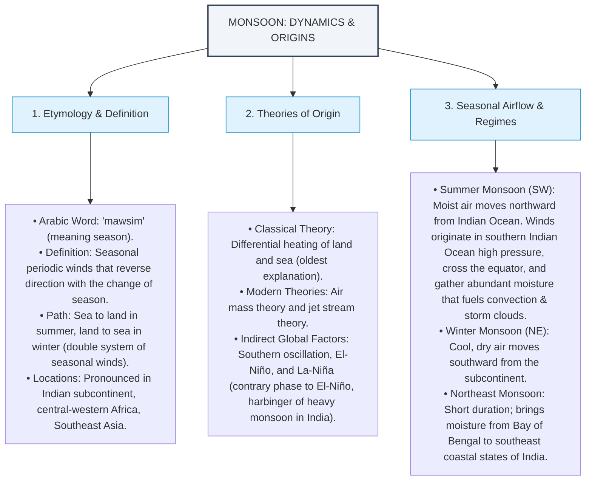
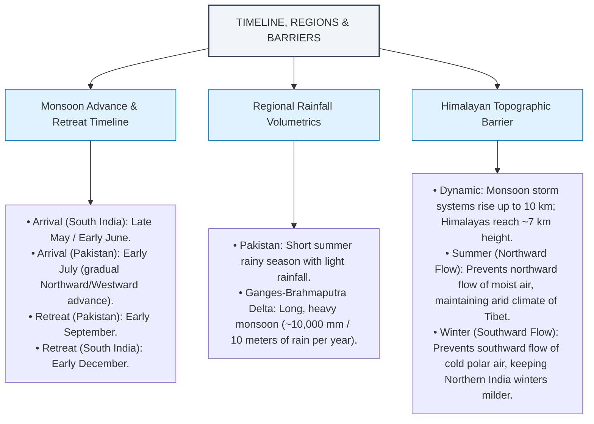
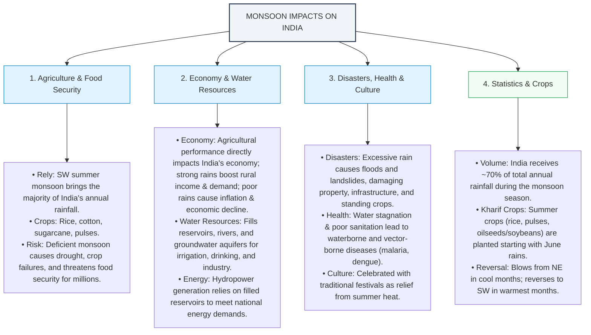

# Monsoon - Visual Flowcharts

```mermaid
flowchart TD
    Title["MONSOON: DYNAMICS & ORIGINS"]
    Title --> Intro["1. Etymology & Definition"]
    Title --> Theories["2. Theories of Origin"]
    Title --> Flow["3. Seasonal Airflow & Regimes"]

    Intro --> Intro_Bullets["• Arabic Word: 'mawsim' (meaning season).<br>• Definition: Seasonal periodic winds that reverse direction with the change of season.<br>• Path: Sea to land in summer, land to sea in winter (double system of seasonal winds).<br>• Locations: Pronounced in Indian subcontinent, central-western Africa, Southeast Asia."]

    Theories --> Theories_Bullets["• Classical Theory: Differential heating of land and sea (oldest explanation).<br>• Modern Theories: Air mass theory and jet stream theory.<br>• Indirect Global Factors: Southern oscillation, El-Niño, and La-Niña (contrary phase to El-Niño, harbinger of heavy monsoon in India)."]

    Flow --> Flow_Bullets["• Summer Monsoon (SW): Moist air moves northward from Indian Ocean. Winds originate in southern Indian Ocean high pressure, cross the equator, and gather abundant moisture that fuels convection & storm clouds.<br>• Winter Monsoon (NE): Cool, dry air moves southward from the subcontinent.<br>• Northeast Monsoon: Short duration; brings moisture from Bay of Bengal to southeast coastal states of India."]

    style Title fill:#f1f5f9,stroke:#334155,stroke-width:2px
    style Intro fill:#e0f2fe,stroke:#0284c7,stroke-width:1px
    style Theories fill:#e0f2fe,stroke:#0284c7,stroke-width:1px
    style Flow fill:#e0f2fe,stroke:#0284c7,stroke-width:1px
```

---

## 2. Timeline, Regional Volumetrics & Topographic Barriers

```mermaid
flowchart TD
    Title["TIMELINE, REGIONS & BARRIERS"]
    Title --> Timeline["Monsoon Advance & Retreat Timeline"]
    Title --> Volumetrics["Regional Rainfall Volumetrics"]
    Title --> Barrier["Himalayan Topographic Barrier"]

    Timeline --> Time_Bullets["• Arrival (South India): Late May / Early June.<br>• Arrival (Pakistan): Early July (gradual Northward/Westward advance).<br>• Retreat (Pakistan): Early September.<br>• Retreat (South India): Early December."]

    Volumetrics --> Vol_Bullets["• Pakistan: Short summer rainy season with light rainfall.<br>• Ganges-Brahmaputra Delta: Long, heavy monsoon (~10,000 mm / 10 meters of rain per year)."]

    Barrier --> Barr_Bullets["• Dynamic: Monsoon storm systems rise up to 10 km; Himalayas reach ~7 km height.<br>• Summer (Northward Flow): Prevents northward flow of moist air, maintaining arid climate of Tibet.<br>• Winter (Southward Flow): Prevents southward flow of cold polar air, keeping Northern India winters milder."]

    style Title fill:#f1f5f9,stroke:#334155,stroke-width:2px
    style Timeline fill:#e0f2fe,stroke:#0284c7,stroke-width:1px
    style Volumetrics fill:#e0f2fe,stroke:#0284c7,stroke-width:1px
    style Barrier fill:#e0f2fe,stroke:#0284c7,stroke-width:1px
```

---

## 3. Monsoon Impacts on India

```mermaid
flowchart TD
    Title["MONSOON IMPACTS ON INDIA"]
    Title --> Agri["1. Agriculture & Food Security"]
    Title --> Econ["2. Economy & Water Resources"]
    Title --> DisHealth["3. Disasters, Health & Culture"]
    Title --> Statistics["4. Statistics & Crops"]

    Agri --> Agri_Bullets["• Rely: SW summer monsoon brings the majority of India's annual rainfall.<br>• Crops: Rice, cotton, sugarcane, pulses.<br>• Risk: Deficient monsoon causes drought, crop failures, and threatens food security for millions."]

    Econ --> Econ_Bullets["• Economy: Agricultural performance directly impacts India's economy; strong rains boost rural income & demand; poor rains cause inflation & economic decline.<br>• Water Resources: Fills reservoirs, rivers, and groundwater aquifers for irrigation, drinking, and industry.<br>• Energy: Hydropower generation relies on filled reservoirs to meet national energy demands."]

    DisHealth --> DH_Bullets["• Disasters: Excessive rain causes floods and landslides, damaging property, infrastructure, and standing crops.<br>• Health: Water stagnation & poor sanitation lead to waterborne and vector-borne diseases (malaria, dengue).<br>• Culture: Celebrated with traditional festivals as relief from summer heat."]

    Statistics --> Stat_Bullets["• Volume: India receives ~70% of total annual rainfall during the monsoon season.<br>• Kharif Crops: Summer crops (rice, pulses, oilseeds/soybeans) are planted starting with June rains.<br>• Reversal: Blows from NE in cool months; reverses to SW in warmest months."]

    style Title fill:#f1f5f9,stroke:#334155,stroke-width:2px
    style Agri fill:#e0f2fe,stroke:#0284c7,stroke-width:1px
    style Econ fill:#e0f2fe,stroke:#0284c7,stroke-width:1px
    style DisHealth fill:#e0f2fe,stroke:#0284c7,stroke-width:1px
    style Statistics fill:#f0fdf4,stroke:#16a34a,stroke-width:1px
```
