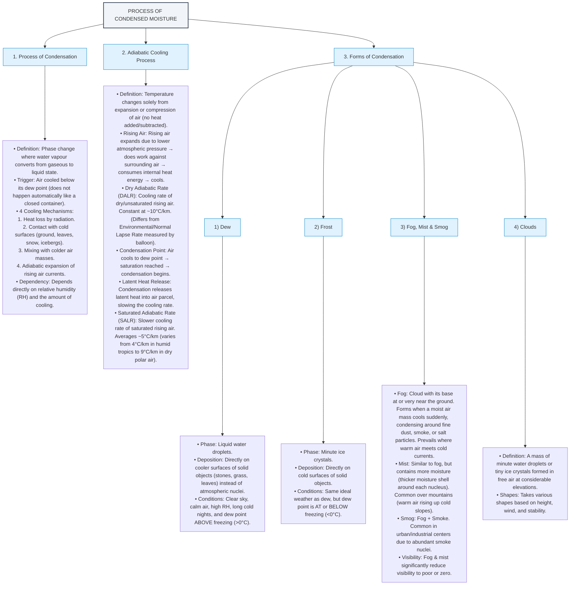

# Process and forms of Condensation - Visual Flowcharts

```mermaid
flowchart TD
    Title["PROCESS OF CONDENSED MOISTURE"]
    Title --> PC["1. Process of Condensation"]
    Title --> AC["2. Adiabatic Cooling Process"]
    Title --> FC["3. Forms of Condensation"]

    PC --> PC_Bullets["• Definition: Phase change where water vapour converts from gaseous to liquid state.<br>• Trigger: Air cooled below its dew point (does not happen automatically like a closed container).<br>• 4 Cooling Mechanisms:<br>  1. Heat loss by radiation.<br>  2. Contact with cold surfaces (ground, leaves, snow, icebergs).<br>  3. Mixing with colder air masses.<br>  4. Adiabatic expansion of rising air currents.<br>• Dependency: Depends directly on relative humidity (RH) and the amount of cooling."]

    AC --> AC_Bullets["• Definition: Temperature changes solely from expansion or compression of air (no heat added/subtracted).<br>• Rising Air: Rising air expands due to lower atmospheric pressure → does work against surrounding air → consumes internal heat energy → cools.<br>• Dry Adiabatic Rate (DALR): Cooling rate of dry/unsaturated rising air. Constant at ~10°C/km. (Differs from Environmental/Normal Lapse Rate measured by balloon).<br>• Condensation Point: Air cools to dew point → saturation reached → condensation begins.<br>• Latent Heat Release: Condensation releases latent heat into air parcel, slowing the cooling rate.<br>• Saturated Adiabatic Rate (SALR): Slower cooling rate of saturated rising air. Averages ~5°C/km (varies from 4°C/km in humid tropics to 9°C/km in dry polar air)."]

    FC --> Dew["1) Dew"]
    FC --> Frost["2) Frost"]
    FC --> Fog["3) Fog, Mist & Smog"]
    FC --> Cloud["4) Clouds"]

    Dew --> Dew_Bullets["• Phase: Liquid water droplets.<br>• Deposition: Directly on cooler surfaces of solid objects (stones, grass, leaves) instead of atmospheric nuclei.<br>• Conditions: Clear sky, calm air, high RH, long cold nights, and dew point ABOVE freezing (>0°C)."]
    
    Frost --> Frost_Bullets["• Phase: Minute ice crystals.<br>• Deposition: Directly on cold surfaces of solid objects.<br>• Conditions: Same ideal weather as dew, but dew point is AT or BELOW freezing (<0°C)."]

    Fog --> Fog_Bullets["• Fog: Cloud with its base at or very near the ground. Forms when a moist air mass cools suddenly, condensing around fine dust, smoke, or salt particles. Prevails where warm air meets cold currents.<br>• Mist: Similar to fog, but contains more moisture (thicker moisture shell around each nucleus). Common over mountains (warm air rising up cold slopes).<br>• Smog: Fog + Smoke. Common in urban/industrial centers due to abundant smoke nuclei.<br>• Visibility: Fog & mist significantly reduce visibility to poor or zero."]

    Cloud --> Cloud_Bullets["• Definition: A mass of minute water droplets or tiny ice crystals formed in free air at considerable elevations.<br>• Shapes: Takes various shapes based on height, wind, and stability."]

    style Title fill:#f1f5f9,stroke:#334155,stroke-width:2px
    style PC fill:#e0f2fe,stroke:#0284c7,stroke-width:1px
    style AC fill:#e0f2fe,stroke:#0284c7,stroke-width:1px
    style FC fill:#e0f2fe,stroke:#0284c7,stroke-width:1px
    style Dew fill:#e0f2fe,stroke:#0284c7,stroke-width:1px
    style Frost fill:#e0f2fe,stroke:#0284c7,stroke-width:1px
    style Fog fill:#e0f2fe,stroke:#0284c7,stroke-width:1px
    style Cloud fill:#e0f2fe,stroke:#0284c7,stroke-width:1px
```
