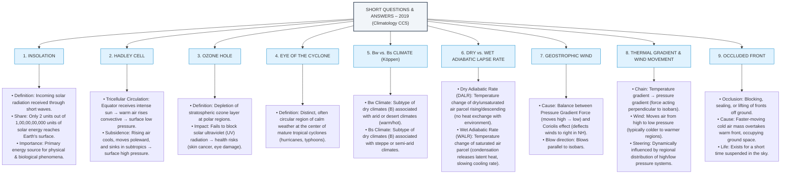

# Short Questions 2019 Climatology - Visual Flowcharts

```mermaid
flowchart TD
    Title["SHORT QUESTIONS & ANSWERS – 2019 (Climatology CC5)"]
    Title --> Q1["1. INSOLATION"]
    Title --> Q2["2. HADLEY CELL"]
    Title --> Q3["3. OZONE HOLE"]
    Title --> Q4["4. EYE OF THE CYCLONE"]
    Title --> Q5["5. Bw vs. Bs CLIMATE (Köppen)"]
    Title --> Q6["6. DRY vs. WET ADIABATIC LAPSE RATE"]
    Title --> Q7["7. GEOSTROPHIC WIND"]
    Title --> Q8["8. THERMAL GRADIENT & WIND MOVEMENT"]
    Title --> Q9["9. OCCLUDED FRONT"]

    Q1 --> Q1_Bullets["• Definition: Incoming solar radiation received through short waves.<br>• Share: Only 2 units out of 1,00,00,00,000 units of solar energy reaches Earth's surface.<br>• Importance: Primary energy source for physical & biological phenomena."]

    Q2 --> Q2_Bullets["• Tricellular Circulation: Equator receives intense sun → warm air rises convective → surface low pressure.<br>• Subsidence: Rising air cools, moves poleward, and sinks in subtropics → surface high pressure."]

    Q3 --> Q3_Bullets["• Definition: Depletion of stratospheric ozone layer at polar regions.<br>• Impact: Fails to block solar ultraviolet (UV) radiation → health risks (skin cancer, eye damage)."]

    Q4 --> Q4_Bullets["• Definition: Distinct, often circular region of calm weather at the center of mature tropical cyclones (hurricanes, typhoons)."]

    Q5 --> Q5_Bullets["• Bw Climate: Subtype of dry climates (B) associated with arid or desert climates (warm/hot).<br>• Bs Climate: Subtype of dry climates (B) associated with steppe or semi-arid climates."]

    Q6 --> Q6_Bullets["• Dry Adiabatic Rate (DALR): Temperature change of dry/unsaturated air parcel rising/descending (no heat exchange with environment).<br>• Wet Adiabatic Rate (WALR): Temperature change of saturated air parcel (condensation releases latent heat, slowing cooling rate)."]

    Q7 --> Q7_Bullets["• Cause: Balance between Pressure Gradient Force (moves high → low) and Coriolis effect (deflects winds to right in NH).<br>• Blow direction: Blows parallel to isobars."]

    Q8 --> Q8_Bullets["• Chain: Temperature gradient → pressure gradient (force acting perpendicular to isobars).<br>• Wind: Moves air from high to low pressure (typically colder to warmer regions).<br>• Steering: Dynamically influenced by regional distribution of high/low pressure systems."]

    Q9 --> Q9_Bullets["• Occlusion: Blocking, sealing, or lifting of fronts off ground.<br>• Cause: Faster-moving cold air mass overtakes warm front, occupying ground space.<br>• Life: Exists for a short time suspended in the sky."]

    style Title fill:#f1f5f9,stroke:#334155,stroke-width:2px
    style Q1 fill:#e0f2fe,stroke:#0284c7,stroke-width:1px
    style Q2 fill:#e0f2fe,stroke:#0284c7,stroke-width:1px
    style Q3 fill:#e0f2fe,stroke:#0284c7,stroke-width:1px
    style Q4 fill:#e0f2fe,stroke:#0284c7,stroke-width:1px
    style Q5 fill:#e0f2fe,stroke:#0284c7,stroke-width:1px
    style Q6 fill:#e0f2fe,stroke:#0284c7,stroke-width:1px
    style Q7 fill:#e0f2fe,stroke:#0284c7,stroke-width:1px
    style Q8 fill:#e0f2fe,stroke:#0284c7,stroke-width:1px
    style Q9 fill:#e0f2fe,stroke:#0284c7,stroke-width:1px
```
