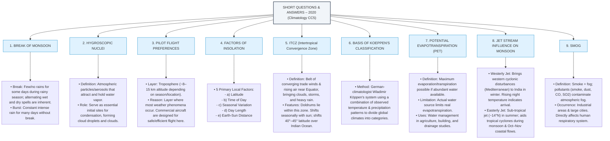

# Short Questions 2020 Climatology - Visual Flowcharts

```mermaid
flowchart TD
    Title["SHORT QUESTIONS & ANSWERS – 2020 (Climatology CC5)"]
    Title --> Q1["1. BREAK OF MONSOON"]
    Title --> Q2["2. HYGROSCOPIC NUCLEI"]
    Title --> Q3["3. PILOT FLIGHT PREFERENCES"]
    Title --> Q4["4. FACTORS OF INSOLATION"]
    Title --> Q5["5. ITCZ (Intertropical Convergence Zone)"]
    Title --> Q6["6. BASIS OF KOEPPEN'S CLASSIFICATION"]
    Title --> Q7["7. POTENTIAL EVAPOTRANSPIRATION (PET)"]
    Title --> Q8["8. JET STREAM INFLUENCE ON MONSOON"]
    Title --> Q9["9. SMOG"]

    Q1 --> Q1_Bullets["• Break: Few/no rains for some days during rainy season; alternating wet and dry spells are inherent.<br>• Burst: Constant intense rain for many days without break."]

    Q2 --> Q2_Bullets["• Definition: Atmospheric particles/aerosols that attract and hold water vapor.<br>• Role: Serve as essential initial sites for condensation, forming cloud droplets and clouds."]

    Q3 --> Q3_Bullets["• Layer: Troposphere (~8–15 km altitude depending on season/location).<br>• Reason: Layer where most weather phenomena occur. Commercial aircraft are designed for safe/efficient flight here."]

    Q4 --> Q4_Bullets["• 5 Primary Local Factors:<br>  - a) Latitude<br>  - b) Time of Day<br>  - c) Seasonal Variation<br>  - d) Day Length<br>  - e) Earth-Sun Distance"]

    Q5 --> Q5_Bullets["• Definition: Belt of converging trade winds & rising air near Equator, bringing clouds, storms, and heavy rain.<br>• Features: Doldrums lie within this zone. Shifts seasonally with sun; shifts 40°–45° latitude over Indian Ocean."]

    Q6 --> Q6_Bullets["• Method: German-climatologist Wladimir Köppen's system using a combination of observed temperature & precipitation patterns to divide global climates into categories."]

    Q7 --> Q7_Bullets["• Definition: Maximum evaporation/transpiration possible if abundant water available.<br>• Limitation: Actual water source limits real evapotranspiration.<br>• Uses: Water management in agriculture, building, and drainage studies."]

    Q8 --> Q8_Bullets["• Westerly Jet: Brings western cyclonic disturbances (Mediterranean) to India in winter. Rising night temperature indicates arrival.<br>• Easterly Jet: Sub-tropical jet (~14°N) in summer; aids tropical cyclones during monsoon & Oct–Nov coastal flows."]

    Q9 --> Q9_Bullets["• Definition: Smoke + fog; pollutants (smoke, dust, CO, SO2) contaminate atmospheric fog.<br>• Occurrence: Industrial areas & large cities. Directly affects human respiratory system."]

    style Title fill:#f1f5f9,stroke:#334155,stroke-width:2px
    style Q1 fill:#e0f2fe,stroke:#0284c7,stroke-width:1px
    style Q2 fill:#e0f2fe,stroke:#0284c7,stroke-width:1px
    style Q3 fill:#e0f2fe,stroke:#0284c7,stroke-width:1px
    style Q4 fill:#e0f2fe,stroke:#0284c7,stroke-width:1px
    style Q5 fill:#e0f2fe,stroke:#0284c7,stroke-width:1px
    style Q6 fill:#e0f2fe,stroke:#0284c7,stroke-width:1px
    style Q7 fill:#e0f2fe,stroke:#0284c7,stroke-width:1px
    style Q8 fill:#e0f2fe,stroke:#0284c7,stroke-width:1px
    style Q9 fill:#e0f2fe,stroke:#0284c7,stroke-width:1px
```
