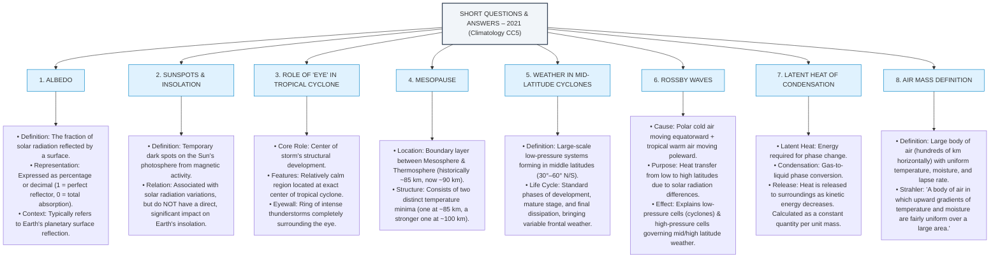

# Short Questions 2021 Climatology - Visual Flowcharts

```mermaid
flowchart TD
    Title["SHORT QUESTIONS & ANSWERS – 2021 (Climatology CC5)"]
    Title --> Q1["1. ALBEDO"]
    Title --> Q2["2. SUNSPOTS & INSOLATION"]
    Title --> Q3["3. ROLE OF 'EYE' IN TROPICAL CYCLONE"]
    Title --> Q4["4. MESOPAUSE"]
    Title --> Q5["5. WEATHER IN MID-LATITUDE CYCLONES"]
    Title --> Q6["6. ROSSBY WAVES"]
    Title --> Q7["7. LATENT HEAT OF CONDENSATION"]
    Title --> Q8["8. AIR MASS DEFINITION"]

    Q1 --> Q1_Bullets["• Definition: The fraction of solar radiation reflected by a surface.<br>• Representation: Expressed as percentage or decimal (1 = perfect reflector, 0 = total absorption).<br>• Context: Typically refers to Earth's planetary surface reflection."]

    Q2 --> Q2_Bullets["• Definition: Temporary dark spots on the Sun's photosphere from magnetic activity.<br>• Relation: Associated with solar radiation variations, but do NOT have a direct, significant impact on Earth's insolation."]

    Q3 --> Q3_Bullets["• Core Role: Center of storm's structural development.<br>• Features: Relatively calm region located at exact center of tropical cyclone.<br>• Eyewall: Ring of intense thunderstorms completely surrounding the eye."]

    Q4 --> Q4_Bullets["• Location: Boundary layer between Mesosphere & Thermosphere (historically ~85 km, now ~90 km).<br>• Structure: Consists of two distinct temperature minima (one at ~85 km, a stronger one at ~100 km)."]

    Q5 --> Q5_Bullets["• Definition: Large-scale low-pressure systems forming in middle latitudes (30°–60° N/S).<br>• Life Cycle: Standard phases of development, mature stage, and final dissipation, bringing variable frontal weather."]

    Q6 --> Q6_Bullets["• Cause: Polar cold air moving equatorward + tropical warm air moving poleward.<br>• Purpose: Heat transfer from low to high latitudes due to solar radiation differences.<br>• Effect: Explains low-pressure cells (cyclones) & high-pressure cells governing mid/high latitude weather."]

    Q7 --> Q7_Bullets["• Latent Heat: Energy required for phase change.<br>• Condensation: Gas-to-liquid phase conversion.<br>• Release: Heat is released to surroundings as kinetic energy decreases. Calculated as a constant quantity per unit mass."]

    Q8 --> Q8_Bullets["• Definition: Large body of air (hundreds of km horizontally) with uniform temperature, moisture, and lapse rate.<br>• Strahler: 'A body of air in which upward gradients of temperature and moisture are fairly uniform over a large area.'"]

    style Title fill:#f1f5f9,stroke:#334155,stroke-width:2px
    style Q1 fill:#e0f2fe,stroke:#0284c7,stroke-width:1px
    style Q2 fill:#e0f2fe,stroke:#0284c7,stroke-width:1px
    style Q3 fill:#e0f2fe,stroke:#0284c7,stroke-width:1px
    style Q4 fill:#e0f2fe,stroke:#0284c7,stroke-width:1px
    style Q5 fill:#e0f2fe,stroke:#0284c7,stroke-width:1px
    style Q6 fill:#e0f2fe,stroke:#0284c7,stroke-width:1px
    style Q7 fill:#e0f2fe,stroke:#0284c7,stroke-width:1px
    style Q8 fill:#e0f2fe,stroke:#0284c7,stroke-width:1px
```
