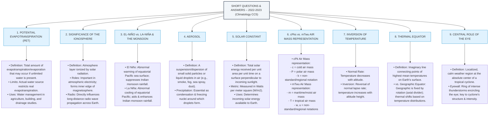

# Short Questions 2022-2023 Climatology - Visual Flowcharts

```mermaid
flowchart TD
    Title["SHORT QUESTIONS & ANSWERS – 2022-2023 (Climatology CC5)"]
    Title --> Q1["1. POTENTIAL EVAPOTRANSPIRATION (PET)"]
    Title --> Q2["2. SIGNIFICANCE OF THE IONOSPHERE"]
    Title --> Q3["3. EL-NIÑO vs. LA-NIÑA & THE MONSOON"]
    Title --> Q4["4. AEROSOL"]
    Title --> Q5["5. SOLAR CONSTANT"]
    Title --> Q6["6. cPks vs. mTwu AIR MASS REPRESENTATION"]
    Title --> Q7["7. INVERSION OF TEMPERATURE"]
    Title --> Q8["8. THERMAL EQUATOR"]
    Title --> Q9["9. CENTRAL ROLE OF THE EYE"]

    Q1 --> Q1_Bullets["• Definition: Total amount of evapotranspiration/evaporation that may occur if unlimited water is present.<br>• Limits: Actual water source restricts real evapotranspiration.<br>• Uses: Water management in agriculture, building, and drainage studies."]

    Q2 --> Q2_Bullets["• Definition: Atmosphere layer ionized by solar radiation.<br>• Roles: Important in atmospheric electricity; forms inner edge of magnetosphere.<br>• Radio: Directly influences long-distance radio wave propagation across Earth."]

    Q3 --> Q3_Bullets["• El Niño: Abnormal warming of equatorial Pacific sea surface; suppresses Indian monsoon rainfall.<br>• La Niña: Abnormal cooling of equatorial Pacific; aids & enhances Indian monsoon rainfall."]

    Q4 --> Q4_Bullets["• Definition: A suspension/dispersion of small solid particles or liquid droplets in air (e.g., smoke, fog, sea spray, dust).<br>• Precipitation: Essential as condensation & freezing nuclei around which droplets form."]

    Q5 --> Q5_Bullets["• Definition: Total solar energy received per unit area per unit time on a surface perpendicular to incoming sunlight.<br>• Metric: Measured in Watts per meter square (W/m2).<br>• Uses: Determines incoming solar energy available to Earth."]

    Q6 --> Q6_Bullets["• cPk Air Mass representation:<br>  - c = cold air mass<br>  - P = polar air mass<br>  - k = non-standard/regional notation<br>• mTwu Air Mass representation:<br>  - m = maritime/moist air mass<br>  - T = tropical air mass<br>  - w, u = non-standard/regional notations"]

    Q7 --> Q7_Bullets["• Normal Rate: Temperature decreases with altitude.<br>• Inversion: Reversal of normal lapse rate; temperature increases with altitude height."]

    Q8 --> Q8_Bullets["• Definition: Imaginary line connecting points of highest mean temperatures on Earth's surface.<br>• vs. Geographic Equator: Geographic is fixed by rotation (axial divider); thermal shifts based on temperature distributions."]

    Q9 --> Q9_Bullets["• Definition: Localized, calm weather region at the absolute center of a tropical cyclone.<br>• Eyewall: Ring of intense thunderstorms encircling the eye; key to cyclone's structure & intensity."]

    style Title fill:#f1f5f9,stroke:#334155,stroke-width:2px
    style Q1 fill:#e0f2fe,stroke:#0284c7,stroke-width:1px
    style Q2 fill:#e0f2fe,stroke:#0284c7,stroke-width:1px
    style Q3 fill:#e0f2fe,stroke:#0284c7,stroke-width:1px
    style Q4 fill:#e0f2fe,stroke:#0284c7,stroke-width:1px
    style Q5 fill:#e0f2fe,stroke:#0284c7,stroke-width:1px
    style Q6 fill:#e0f2fe,stroke:#0284c7,stroke-width:1px
    style Q7 fill:#e0f2fe,stroke:#0284c7,stroke-width:1px
    style Q8 fill:#e0f2fe,stroke:#0284c7,stroke-width:1px
    style Q9 fill:#e0f2fe,stroke:#0284c7,stroke-width:1px
```
