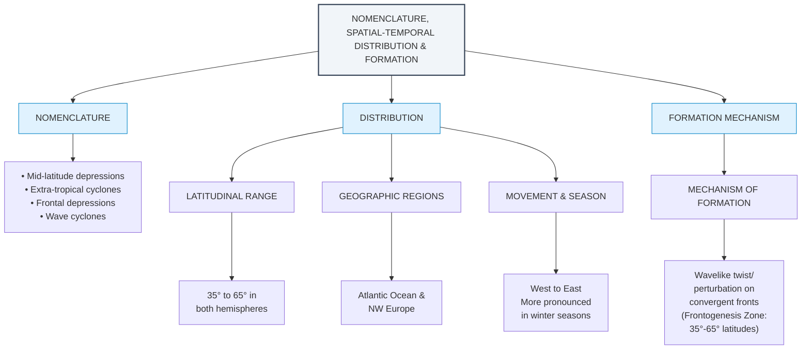
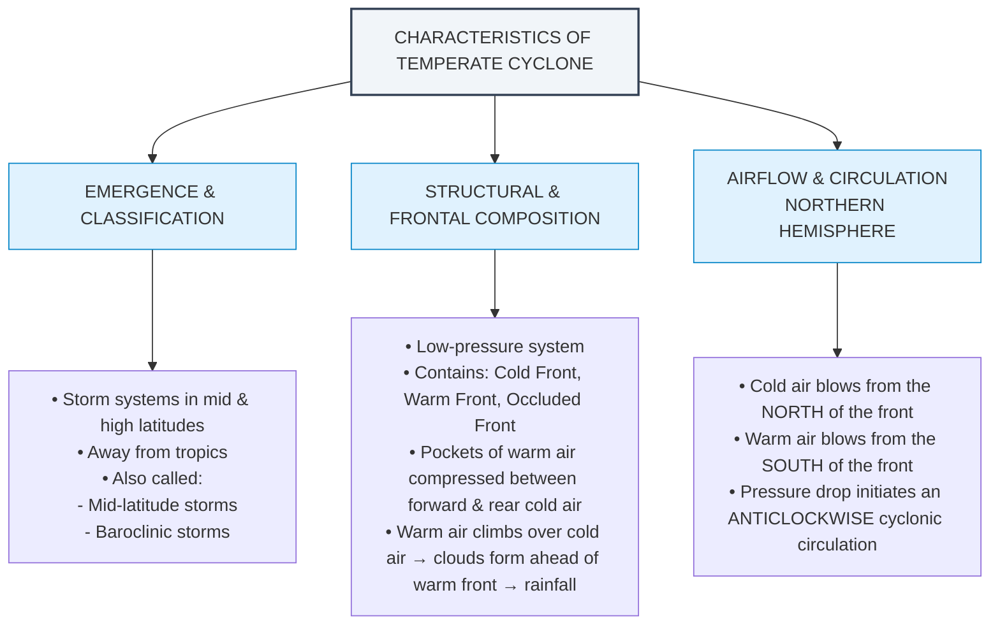
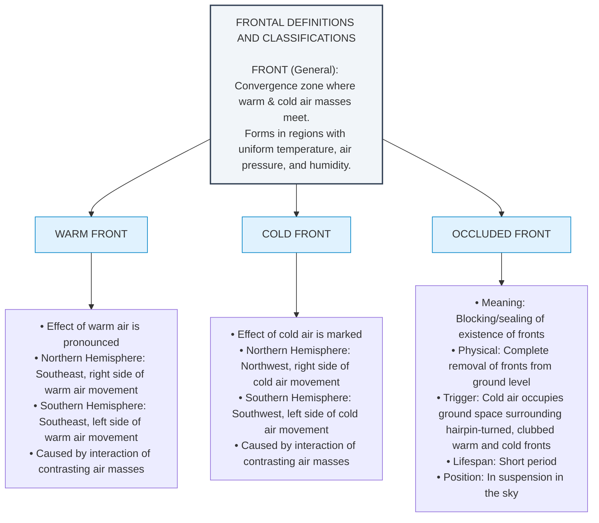
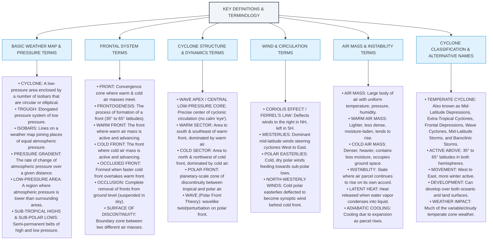

# Temperate Cyclone - Visual Flowcharts

---

## 2. Characteristics of Temperate Cyclone

---

## 3. Frontal Definitions & Classifications

---

## 4. Origin of Temperate Cyclone: Polar Front Theory

```mermaid
flowchart TD
    Title["ORIGIN OF TEMPERATE CYCLONE: THE POLAR FRONT THEORY<br>(By Vilhelm Bjerknes, J. Bjerknes & Associates, 'Bergen School of Meteorologists', end of World War I)"]
    Title --> AMC[AIR MASS CONVERGENCE]
    AMC --> AMC_Text["Warm-humid air from Tropics + Dry-cold air from Poles = POLAR FRONT<br>(Occurs between sub-tropical highs & sub-polar lows)"]
    
    AMC_Text --> PII[PHYSICAL INTERACTION & INSTABILITY]
    PII --> PII_Bullets["• Cold air is denser/heavier → occupies LOWER ground space<br>• Warm sub-tropical air is MECHANICALLY PUSHED UP<br>• Instability is generated → LOW PRESSURE created at the junction<br>  (center of interaction where warm and cold fronts differentiate)"]

    PII_Bullets --> WFA[WAVE FORMATION & AIR MASS KINEMATICS<br>Northern Hemisphere Example]
    WFA --> WFA_Bullets["• Wave formation along front = thermal contrast indicator<br>• Air masses encroach on each other's domains:<br>  - Warm air mass moves NORTHWARD as Westerlies<br>  - Cold air mass originates from POLAR EASTERLIES, moving southward.<br>    As it feeds into the cyclone behind the cold front, it is deflected to<br>    become NORTH-WESTERLY WINDS.<br>• Ferrel's Law: All winds are deflected to the RIGHT<br>• Frontal Asymmetry created:<br>  - EASTERN part of front → Dominated by WARM air mass<br>  - WESTERN part of front → Dominated by COLD air mass<br>• The center of this interaction develops into the CENTRAL LOW-PRESSURE CORE or WAVE APEX of the cyclone.<br>• (Exact reverse is true for the Southern Hemisphere)"]

    style Title fill:#f1f5f9,stroke:#334155,stroke-width:2px
    style AMC fill:#e0f2fe,stroke:#0284c7,stroke-width:1px
    style PII fill:#e0f2fe,stroke:#0284c7,stroke-width:1px
    style WFA fill:#e0f2fe,stroke:#0284c7,stroke-width:1px
```

---

## 5. Stages of Mid-Latitude Cyclone Development

```mermaid
flowchart TD
    Title[STAGES OF MID-LATITUDE CYCLONE DEVELOPMENT]
    Title --> S1[STAGE I: STATIONARY / BEGINNING]
    S1 --> S1_Bullets["• Cold air mass and warm air mass converge along a central axis<br>• Both air masses are almost stable and in contact with each other<br>• Temperature, moisture, and pressure differences exist but are not large enough to create large-scale instability<br>• Over time, warm air mass begins pushing toward the eastern side<br>• Cold air mass impacts become visible on the western side<br>• At late phase: straight/flat formed front is turned/bent by advancing forces"]

    S1_Bullets --> S2[STAGE II: YOUNG ADULT]
    S2 --> S2_Bullets["• Frontiers of two air masses become conspicuously different<br>• Northern Hemisphere: Warm front → eastern part | Cold front → western part<br>• Cold sector: area to north & northwest (cold air mass)<br>• Warm sector: area to south & southeast (warm air mass)<br>• Warm front exhibits more instability (more moisture)<br>• Cold front is relatively more stable (less moisture)<br>• Peak instability at exact junction where fronts meet (future WAVE APEX)<br>• Frontal junction becomes increasingly sharp<br>• Warm sector shrinks; frontal bend sharpens<br>• Warm air is mechanically pushed up → cools → condensation occurs<br>• Latent heat released → further lowered pressure at junction<br>• Cold air originating from Polar Easterlies is deflected right, becoming NORTH-WESTERLY WINDS behind the cold front<br>• Marks the beginning of cyclonic formation"]

    S2_Bullets --> S3[STAGE III: MATURE]
    S3 --> S3_Bullets["• Low air pressure fully initiated at WAVE APEX (driven by condensation)<br>• Low pressure attracts surrounding air<br>• Highly significant vertical updraft of air observed<br>• Direct intensification of Stage II processes<br>• Isobars become closer together (tightening)<br>• Pressure gradient becomes very sharp<br>• Swift updraft moves upward in a whirling manner<br>• Cold air mass invasion grows greater in velocity and area<br>• Warm sector becomes still smaller and continues shrinking<br>• Increasingly sharp turns of the two fronts (peak frontal angularity)<br>• Cyclones march toward eastern side (steered by westerlies)<br>• Brings rapidly changing weather conditions<br>• End of stage: combined front starts lifting above ground (onset of decline)"]

    S3_Bullets --> S4[STAGE IV: OCCLUSION]
    S4 --> S4_Bullets["• Two distinctly formed fronts are compressed; diffusion into one another<br>• Fronts culminate by merging into the OCCLUDED FRONT<br>• Cyclone starts declining: central low pressure (Wave Apex) gets weakened<br>• Overall intensity lowered; wind velocity on steady decline<br>• Convergence zone detaches completely from ground surface<br>• Ground level becomes entirely occupied by cold air<br>• Warm sector entirely shifted above ground<br>• Line of discontinuity exists only in the sky, no longer on the ground"]

    S4_Bullets --> S5[STAGE V: LATE OCCLUSION / DISSIPATION]
    S5 --> S5_Bullets["• Early occlusion: cyclone still dynamic & strong<br>• Late occlusion: cyclone substantially weakened<br>• More surface areas occupied exclusively by cold air mass (denser & heavier)<br>• Areas previously belonging to warm air are governed by cold air<br>• Pushed-up warm air cools (thermodynamic impact of cold air + adiabatic cooling)<br>• Low pressure is completely eliminated; atmosphere returns to normal<br>• Occluded front completely removed from sky = FINAL DISSIPATION"]

    style Title fill:#f1f5f9,stroke:#334155,stroke-width:2px
    style S1 fill:#e0f2fe,stroke:#0284c7,stroke-width:1px
    style S2 fill:#e0f2fe,stroke:#0284c7,stroke-width:1px
    style S3 fill:#e0f2fe,stroke:#0284c7,stroke-width:1px
    style S4 fill:#e0f2fe,stroke:#0284c7,stroke-width:1px
    style S5 fill:#e0f2fe,stroke:#0284c7,stroke-width:1px
```

---

## 6. Key Definitions & Terminology

