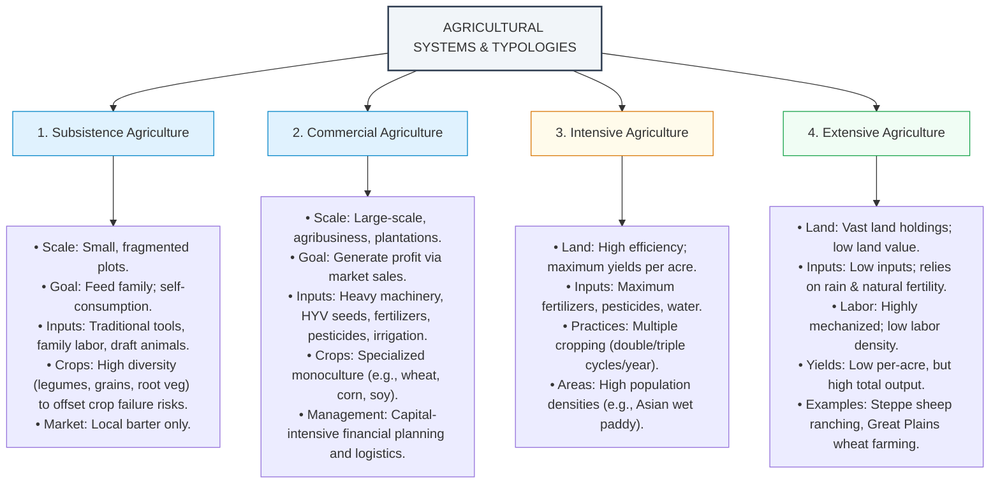

# Agriculture: Systems and Practices - Visual Flowcharts

```mermaid
flowchart TD
    Title["AGRICULTURAL SYSTEMS & TYPOLOGIES"]
    Title --> Subs["1. Subsistence Agriculture"]
    Title --> Comm["2. Commercial Agriculture"]
    Title --> Intens["3. Intensive Agriculture"]
    Title --> Extens["4. Extensive Agriculture"]

    Subs --> Subs_Bullets["• Scale: Small, fragmented plots.<br>• Goal: Feed family; self-consumption.<br>• Inputs: Traditional tools, family labor, draft animals.<br>• Crops: High diversity (legumes, grains, root veg) to offset crop failure risks.<br>• Market: Local barter only."]

    Comm --> Comm_Bullets["• Scale: Large-scale, agribusiness, plantations.<br>• Goal: Generate profit via market sales.<br>• Inputs: Heavy machinery, HYV seeds, fertilizers, pesticides, irrigation.<br>• Crops: Specialized monoculture (e.g., wheat, corn, soy).<br>• Management: Capital-intensive financial planning and logistics."]

    Intens --> Intens_Bullets["• Land: High efficiency; maximum yields per acre.<br>• Inputs: Maximum fertilizers, pesticides, water.<br>• Practices: Multiple cropping (double/triple cycles/year).<br>• Areas: High population densities (e.g., Asian wet paddy)."]

    Extens --> Extens_Bullets["• Land: Vast land holdings; low land value.<br>• Inputs: Low inputs; relies on rain & natural fertility.<br>• Labor: Highly mechanized; low labor density.<br>• Yields: Low per-acre, but high total output.<br>• Examples: Steppe sheep ranching, Great Plains wheat farming."]

    style Title fill:#f1f5f9,stroke:#334155,stroke-width:2px
    style Subs fill:#e0f2fe,stroke:#0284c7,stroke-width:1px
    style Comm fill:#e0f2fe,stroke:#0284c7,stroke-width:1px
    style Intens fill:#fffbeb,stroke:#d97706,stroke-width:1px
    style Extens fill:#f0fdf4,stroke:#16a34a,stroke-width:1px
```
