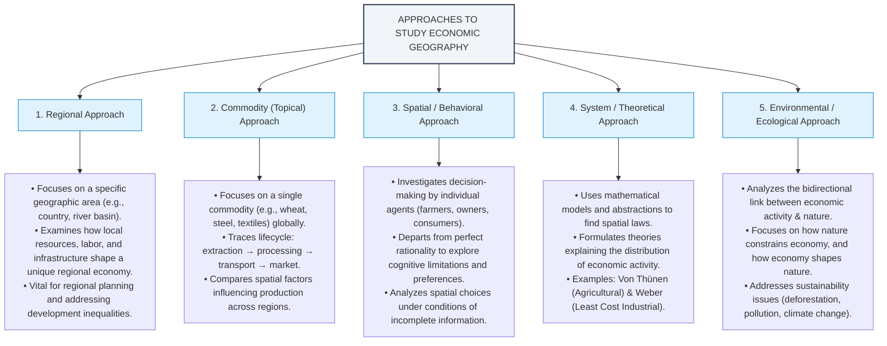

# Approaches to Study Economic Geography - Visual Flowcharts

```mermaid
flowchart TD
    Title["APPROACHES TO STUDY ECONOMIC GEOGRAPHY"]
    Title --> Reg["1. Regional Approach"]
    Title --> Com["2. Commodity (Topical) Approach"]
    Title --> Beh["3. Spatial / Behavioral Approach"]
    Title --> Sys["4. System / Theoretical Approach"]
    Title --> Env["5. Environmental / Ecological Approach"]

    Reg --> Reg_Bullets["• Focuses on a specific geographic area (e.g., country, river basin).<br>• Examines how local resources, labor, and infrastructure shape a unique regional economy.<br>• Vital for regional planning and addressing development inequalities."]

    Com --> Com_Bullets["• Focuses on a single commodity (e.g., wheat, steel, textiles) globally.<br>• Traces lifecycle: extraction → processing → transport → market.<br>• Compares spatial factors influencing production across regions."]

    Beh --> Beh_Bullets["• Investigates decision-making by individual agents (farmers, owners, consumers).<br>• Departs from perfect rationality to explore cognitive limitations and preferences.<br>• Analyzes spatial choices under conditions of incomplete information."]

    Sys --> Sys_Bullets["• Uses mathematical models and abstractions to find spatial laws.<br>• Formulates theories explaining the distribution of economic activity.<br>• Examples: Von Thünen (Agricultural) & Weber (Least Cost Industrial)."]

    Env --> Env_Bullets["• Analyzes the bidirectional link between economic activity & nature.<br>• Focuses on how nature constrains economy, and how economy shapes nature.<br>• Addresses sustainability issues (deforestation, pollution, climate change)."]

    style Title fill:#f1f5f9,stroke:#334155,stroke-width:2px
    style Reg fill:#e0f2fe,stroke:#0284c7,stroke-width:1px
    style Com fill:#e0f2fe,stroke:#0284c7,stroke-width:1px
    style Beh fill:#e0f2fe,stroke:#0284c7,stroke-width:1px
    style Sys fill:#e0f2fe,stroke:#0284c7,stroke-width:1px
    style Env fill:#e0f2fe,stroke:#0284c7,stroke-width:1px
```
