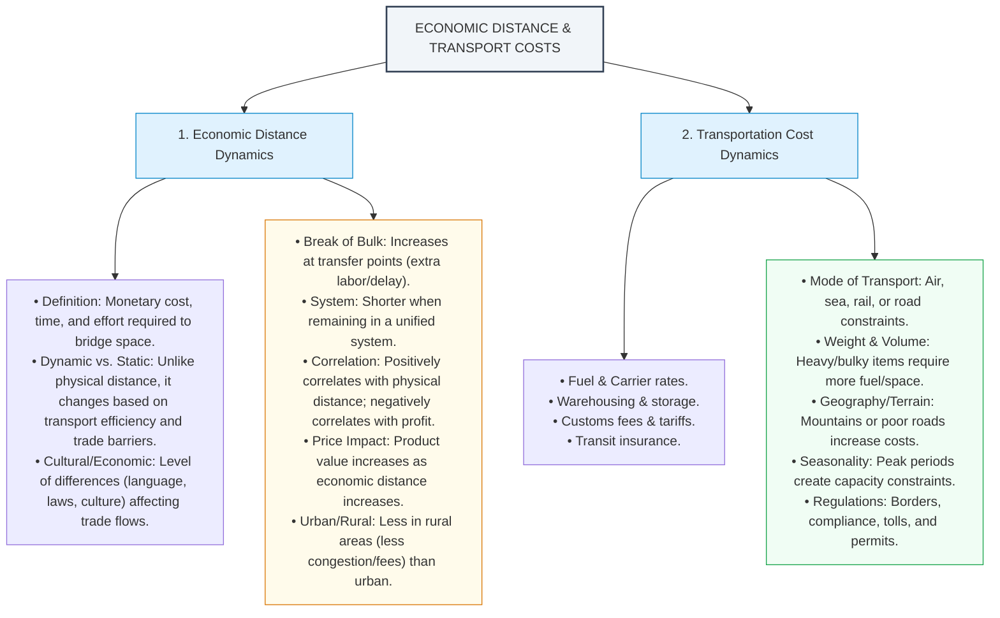

# Economic Distance and Transport Costs - Visual Flowcharts

```mermaid
flowchart TD
    Title["ECONOMIC DISTANCE & TRANSPORT COSTS"]
    Title --> ED["1. Economic Distance Dynamics"]
    Title --> TC["2. Transportation Cost Dynamics"]

    ED --> ED_Def["• Definition: Monetary cost, time, and effort required to bridge space.<br>• Dynamic vs. Static: Unlike physical distance, it changes based on transport efficiency and trade barriers.<br>• Cultural/Economic: Level of differences (language, laws, culture) affecting trade flows."]
    ED --> ED_Feat["• Break of Bulk: Increases at transfer points (extra labor/delay).<br>• System: Shorter when remaining in a unified system.<br>• Correlation: Positively correlates with physical distance; negatively correlates with profit.<br>• Price Impact: Product value increases as economic distance increases.<br>• Urban/Rural: Less in rural areas (less congestion/fees) than urban."]

    TC --> TC_Comp["• Fuel & Carrier rates.<br>• Warehousing & storage.<br>• Customs fees & tariffs.<br>• Transit insurance."]
    TC --> TC_Factors["• Mode of Transport: Air, sea, rail, or road constraints.<br>• Weight & Volume: Heavy/bulky items require more fuel/space.<br>• Geography/Terrain: Mountains or poor roads increase costs.<br>• Seasonality: Peak periods create capacity constraints.<br>• Regulations: Borders, compliance, tolls, and permits."]

    style Title fill:#f1f5f9,stroke:#334155,stroke-width:2px
    style ED fill:#e0f2fe,stroke:#0284c7,stroke-width:1px
    style TC fill:#e0f2fe,stroke:#0284c7,stroke-width:1px
    style ED_Feat fill:#fffbeb,stroke:#d97706,stroke-width:1px
    style TC_Factors fill:#f0fdf4,stroke:#16a34a,stroke-width:1px
```
