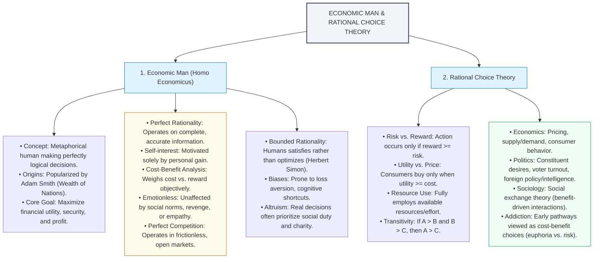

# Economic Man and Rational Choice Theory - Visual Flowcharts

```mermaid
flowchart TD
    Title["ECONOMIC MAN & RATIONAL CHOICE THEORY"]
    Title --> EM["1. Economic Man (Homo Economicus)"]
    Title --> RCT["2. Rational Choice Theory"]

    EM --> EM_Def["• Concept: Metaphorical human making perfectly logical decisions.<br>• Origins: Popularized by Adam Smith (Wealth of Nations).<br>• Core Goal: Maximize financial utility, security, and profit."]
    EM --> EM_Feat["• Perfect Rationality: Operates on complete, accurate information.<br>• Self-interest: Motivated solely by personal gain.<br>• Cost-Benefit Analysis: Weighs cost vs. reward objectively.<br>• Emotionless: Unaffected by social norms, revenge, or empathy.<br>• Perfect Competition: Operates in frictionless, open markets."]
    EM --> EM_Crit["• Bounded Rationality: Humans satisfies rather than optimizes (Herbert Simon).<br>• Biases: Prone to loss aversion, cognitive shortcuts.<br>• Altruism: Real decisions often prioritize social duty and charity."]

    RCT --> RCT_Assump["• Risk vs. Reward: Action occurs only if reward >= risk.<br>• Utility vs. Price: Consumers buy only when utility >= cost.<br>• Resource Use: Fully employs available resources/effort.<br>• Transitivity: If A > B and B > C, then A > C."]
    RCT --> RCT_App["• Economics: Pricing, supply/demand, consumer behavior.<br>• Politics: Constituent desires, voter turnout, foreign policy/intelligence.<br>• Sociology: Social exchange theory (benefit-driven interactions).<br>• Addiction: Early pathways viewed as cost-benefit choices (euphoria vs. risk)."]

    style Title fill:#f1f5f9,stroke:#334155,stroke-width:2px
    style EM fill:#e0f2fe,stroke:#0284c7,stroke-width:1px
    style RCT fill:#e0f2fe,stroke:#0284c7,stroke-width:1px
    style EM_Feat fill:#fffbeb,stroke:#d97706,stroke-width:1px
    style RCT_App fill:#f0fdf4,stroke:#16a34a,stroke-width:1px
```
