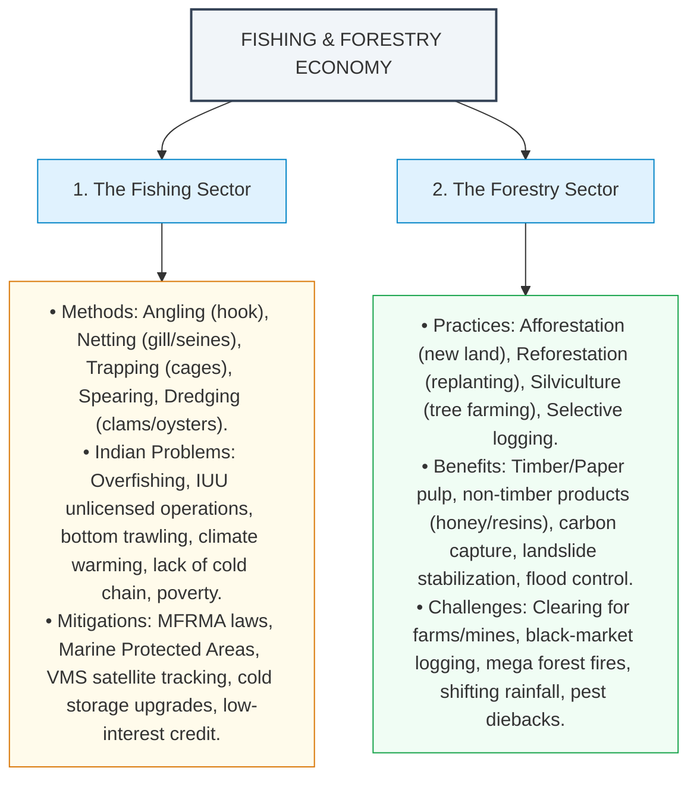

# Fishing and Forestry - Visual Flowcharts

```mermaid
flowchart TD
    Title["FISHING & FORESTRY ECONOMY"]
    Title --> Fish["1. The Fishing Sector"]
    Title --> Forest["2. The Forestry Sector"]

    Fish --> Fish_Meth["• Methods: Angling (hook), Netting (gill/seines), Trapping (cages), Spearing, Dredging (clams/oysters).<br>• Indian Problems: Overfishing, IUU unlicensed operations, bottom trawling, climate warming, lack of cold chain, poverty.<br>• Mitigations: MFRMA laws, Marine Protected Areas, VMS satellite tracking, cold storage upgrades, low-interest credit."]

    Forest --> For_Pract["• Practices: Afforestation (new land), Reforestation (replanting), Silviculture (tree farming), Selective logging.<br>• Benefits: Timber/Paper pulp, non-timber products (honey/resins), carbon capture, landslide stabilization, flood control.<br>• Challenges: Clearing for farms/mines, black-market logging, mega forest fires, shifting rainfall, pest diebacks."]

    style Title fill:#f1f5f9,stroke:#334155,stroke-width:2px
    style Fish fill:#e0f2fe,stroke:#0284c7,stroke-width:1px
    style Forest fill:#e0f2fe,stroke:#0284c7,stroke-width:1px
    style Fish_Meth fill:#fffbeb,stroke:#d97706,stroke-width:1px
    style For_Pract fill:#f0fdf4,stroke:#16a34a,stroke-width:1px
```
