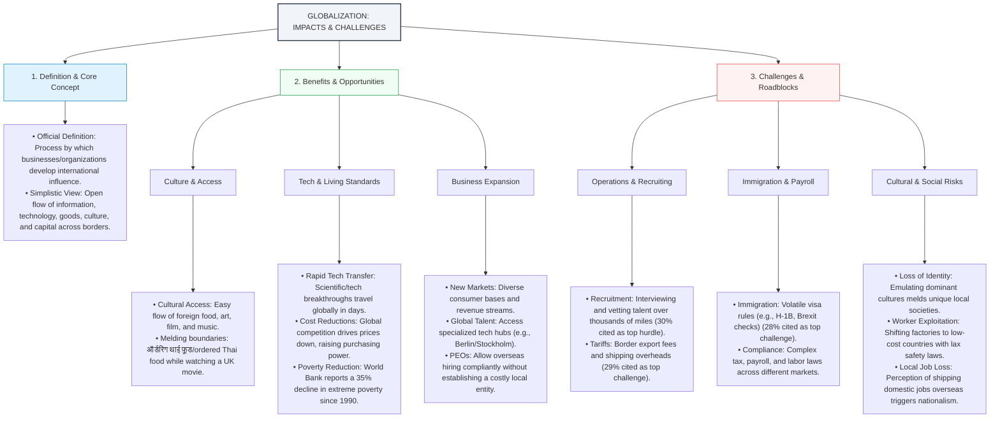

# Globalization - Visual Flowcharts

```mermaid
flowchart TD
    Title["GLOBALIZATION: IMPACTS & CHALLENGES"]
    Title --> Concept["1. Definition & Core Concept"]
    Title --> Benefits["2. Benefits & Opportunities"]
    Title --> Challenges["3. Challenges & Roadblocks"]

    Concept --> Con_Bullets["• Official Definition: Process by which businesses/organizations develop international influence.<br>• Simplistic View: Open flow of information, technology, goods, culture, and capital across borders.<br• Competitive Angle: Embracing global markets is vital to keep a competitive advantage."]

    Benefits --> B1["Culture & Access"]
    Benefits --> B2["Tech & Living Standards"]
    Benefits --> B3["Business Expansion"]

    B1 --> B1_Bullets["• Cultural Access: Easy flow of foreign food, art, film, and music.<br>• Melding boundaries: ऑर्डरिंग थाई फ़ूड/ordered Thai food while watching a UK movie."]
    B2 --> B2_Bullets["• Rapid Tech Transfer: Scientific/tech breakthroughs travel globally in days.<br>• Cost Reductions: Global competition drives prices down, raising purchasing power.<br>• Poverty Reduction: World Bank reports a 35% decline in extreme poverty since 1990."]
    B3 --> B3_Bullets["• New Markets: Diverse consumer bases and revenue streams.<br>• Global Talent: Access specialized tech hubs (e.g., Berlin/Stockholm).<br>• PEOs: Allow overseas hiring compliantly without establishing a costly local entity."]

    Challenges --> C1["Operations & Recruiting"]
    Challenges --> C2["Immigration & Payroll"]
    Challenges --> C3["Cultural & Social Risks"]

    C1 --> C1_Bullets["• Recruitment: Interviewing and vetting talent over thousands of miles (30% cited as top hurdle).<br>• Tariffs: Border export fees and shipping overheads (29% cited as top challenge)."]
    C2 --> C2_Bullets["• Immigration: Volatile visa rules (e.g., H-1B, Brexit checks) (28% cited as top challenge).<br>• Compliance: Complex tax, payroll, and labor laws across different markets."]
    C3 --> C3_Bullets["• Loss of Identity: Emulating dominant cultures melds unique local societies.<br>• Worker Exploitation: Shifting factories to low-cost countries with lax safety laws.<br>• Local Job Loss: Perception of shipping domestic jobs overseas triggers nationalism."]

    style Title fill:#f1f5f9,stroke:#334155,stroke-width:2px
    style Concept fill:#e0f2fe,stroke:#0284c7,stroke-width:1px
    style Benefits fill:#f0fdf4,stroke:#16a34a,stroke-width:1px
    style Challenges fill:#fef2f2,stroke:#ef4444,stroke-width:1px
```
