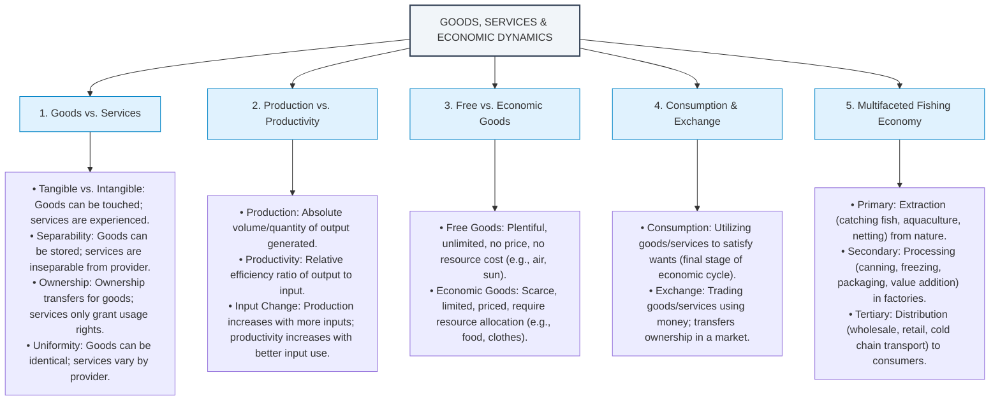

# Goods, Services and Economic Activities - Visual Flowcharts

```mermaid
flowchart TD
    Title["GOODS, SERVICES & ECONOMIC DYNAMICS"]
    Title --> GS["1. Goods vs. Services"]
    Title --> PP["2. Production vs. Productivity"]
    Title --> FE["3. Free vs. Economic Goods"]
    Title --> CE["4. Consumption & Exchange"]
    Title --> Fish["5. Multifaceted Fishing Economy"]

    GS --> GS_Table["• Tangible vs. Intangible: Goods can be touched; services are experienced.<br>• Separability: Goods can be stored; services are inseparable from provider.<br>• Ownership: Ownership transfers for goods; services only grant usage rights.<br>• Uniformity: Goods can be identical; services vary by provider."]

    PP --> PP_Table["• Production: Absolute volume/quantity of output generated.<br>• Productivity: Relative efficiency ratio of output to input.<br>• Input Change: Production increases with more inputs; productivity increases with better input use."]

    FE --> FE_Table["• Free Goods: Plentiful, unlimited, no price, no resource cost (e.g., air, sun).<br>• Economic Goods: Scarce, limited, priced, require resource allocation (e.g., food, clothes)."]

    CE --> CE_Bullets["• Consumption: Utilizing goods/services to satisfy wants (final stage of economic cycle).<br>• Exchange: Trading goods/services using money; transfers ownership in a market."]

    Fish --> Fish_Bullets["• Primary: Extraction (catching fish, aquaculture, netting) from nature.<br>• Secondary: Processing (canning, freezing, packaging, value addition) in factories.<br>• Tertiary: Distribution (wholesale, retail, cold chain transport) to consumers."]

    style Title fill:#f1f5f9,stroke:#334155,stroke-width:2px
    style GS fill:#e0f2fe,stroke:#0284c7,stroke-width:1px
    style PP fill:#e0f2fe,stroke:#0284c7,stroke-width:1px
    style FE fill:#e0f2fe,stroke:#0284c7,stroke-width:1px
    style CE fill:#e0f2fe,stroke:#0284c7,stroke-width:1px
    style Fish fill:#e0f2fe,stroke:#0284c7,stroke-width:1px
```
