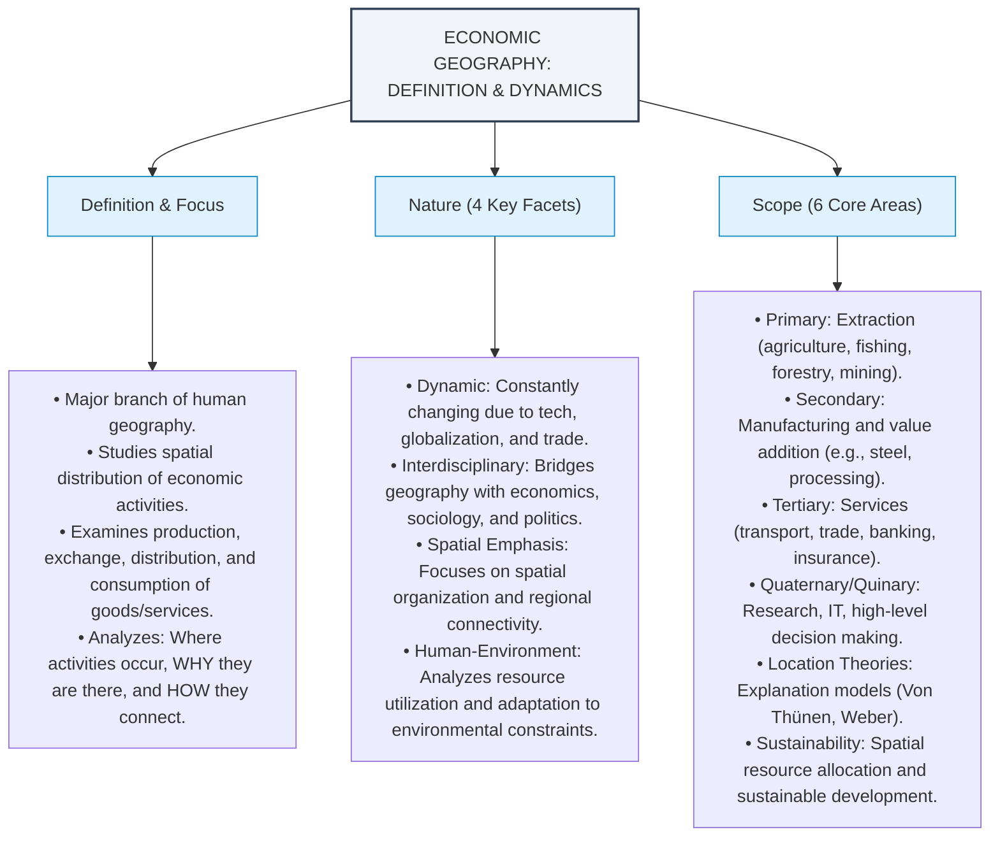

# Introduction to Economic Geography - Visual Flowcharts

```mermaid
flowchart TD
    Title["ECONOMIC GEOGRAPHY: DEFINITION & DYNAMICS"]
    Title --> Def["Definition & Focus"]
    Title --> Nature["Nature (4 Key Facets)"]
    Title --> Scope["Scope (6 Core Areas)"]

    Def --> Def_Bullets["• Major branch of human geography.<br>• Studies spatial distribution of economic activities.<br>• Examines production, exchange, distribution, and consumption of goods/services.<br>• Analyzes: Where activities occur, WHY they are there, and HOW they connect."]

    Nature --> Nat_Bullets["• Dynamic: Constantly changing due to tech, globalization, and trade.<br>• Interdisciplinary: Bridges geography with economics, sociology, and politics.<br>• Spatial Emphasis: Focuses on spatial organization and regional connectivity.<br>• Human-Environment: Analyzes resource utilization and adaptation to environmental constraints."]

    Scope --> Scope_Bullets["• Primary: Extraction (agriculture, fishing, forestry, mining).<br>• Secondary: Manufacturing and value addition (e.g., steel, processing).<br>• Tertiary: Services (transport, trade, banking, insurance).<br>• Quaternary/Quinary: Research, IT, high-level decision making.<br>• Location Theories: Explanation models (Von Thünen, Weber).<br>• Sustainability: Spatial resource allocation and sustainable development."]

    style Title fill:#f1f5f9,stroke:#334155,stroke-width:2px
    style Def fill:#e0f2fe,stroke:#0284c7,stroke-width:1px
    style Nature fill:#e0f2fe,stroke:#0284c7,stroke-width:1px
    style Scope fill:#e0f2fe,stroke:#0284c7,stroke-width:1px
```
