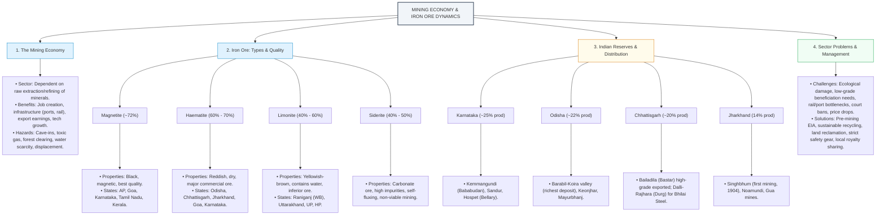

# Mining Economy and Iron Ore - Visual Flowcharts

```mermaid
flowchart TD
    Title["MINING ECONOMY & IRON ORE DYNAMICS"]
    Title --> Mine["1. The Mining Economy"]
    Title --> Ore["2. Iron Ore: Types & Quality"]
    Title --> India["3. Indian Reserves & Distribution"]
    Title --> Prob["4. Sector Problems & Management"]

    Mine --> Mine_Bullets["• Sector: Dependent on raw extraction/refining of minerals.<br>• Benefits: Job creation, infrastructure (ports, rail), export earnings, tech growth.<br>• Hazards: Cave-ins, toxic gas, forest clearing, water scarcity, displacement."]

    Ore --> O1["Magnetite (~72%)"]
    Ore --> O2["Haematite (60% - 70%)"]
    Ore --> O3["Limonite (40% - 60%)"]
    Ore --> O4["Siderite (40% - 50%)"]

    O1 --> O1_Bullets["• Properties: Black, magnetic, best quality.<br>• States: AP, Goa, Karnataka, Tamil Nadu, Kerala."]
    O2 --> O2_Bullets["• Properties: Reddish, dry, major commercial ore.<br>• States: Odisha, Chhattisgarh, Jharkhand, Goa, Karnataka."]
    O3 --> O3_Bullets["• Properties: Yellowish-brown, contains water, inferior ore.<br>• States: Raniganj (WB), Uttarakhand, UP, HP."]
    O4 --> O4_Bullets["• Properties: Carbonate ore, high impurities, self-fluxing, non-viable mining."]

    India --> I1["Karnataka (~25% prod)"]
    India --> I2["Odisha (~22% prod)"]
    India --> I3["Chhattisgarh (~20% prod)"]
    India --> I4["Jharkhand (14% prod)"]

    I1 --> I1_Bullets["• Kemmangundi (Bababudan), Sandur, Hospet (Bellary)."]
    I2 --> I2_Bullets["• Barabil-Koira valley (richest deposit), Keonjhar, Mayurbhanj."]
    I3 --> I3_Bullets["• Bailadila (Bastar) high-grade exported; Dalli-Rajhara (Durg) for Bhilai Steel."]
    I4 --> I4_Bullets["• Singhbhum (first mining, 1904), Noamundi, Gua mines."]

    Prob --> Prob_Bullets["• Challenges: Ecological damage, low-grade beneficiation needs, rail/port bottlenecks, court bans, price drops.<br>• Solutions: Pre-mining EIA, sustainable recycling, land reclamation, strict safety gear, local royalty sharing."]

    style Title fill:#f1f5f9,stroke:#334155,stroke-width:2px
    style Mine fill:#e0f2fe,stroke:#0284c7,stroke-width:1px
    style Ore fill:#e0f2fe,stroke:#0284c7,stroke-width:1px
    style India fill:#fffbeb,stroke:#d97706,stroke-width:1px
    style Prob fill:#f0fdf4,stroke:#16a34a,stroke-width:1px
```
