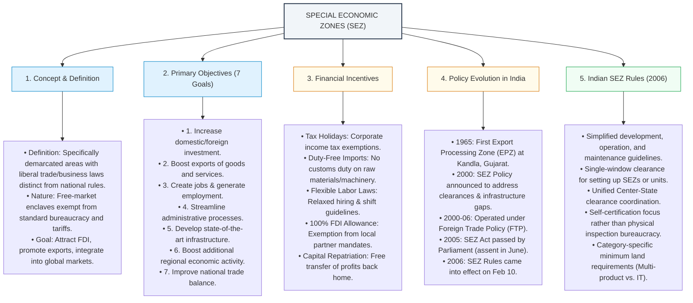

# Special Economic Zone (SEZ) - Visual Flowcharts

```mermaid
flowchart TD
    Title["SPECIAL ECONOMIC ZONES (SEZ)"]
    Title --> Concept["1. Concept & Definition"]
    Title --> Objectives["2. Primary Objectives (7 Goals)"]
    Title --> Incentives["3. Financial Incentives"]
    Title --> India["4. Policy Evolution in India"]
    Title --> Rules["5. Indian SEZ Rules (2006)"]

    Concept --> Con_Bullets["• Definition: Specifically demarcated areas with liberal trade/business laws distinct from national rules.<br>• Nature: Free-market enclaves exempt from standard bureaucracy and tariffs.<br>• Goal: Attract FDI, promote exports, integrate into global markets."]

    Objectives --> Obj_Bullets["• 1. Increase domestic/foreign investment.<br>• 2. Boost exports of goods and services.<br>• 3. Create jobs & generate employment.<br>• 4. Streamline administrative processes.<br>• 5. Develop state-of-the-art infrastructure.<br>• 6. Boost additional regional economic activity.<br>• 7. Improve national trade balance."]

    Incentives --> Inc_Bullets["• Tax Holidays: Corporate income tax exemptions.<br>• Duty-Free Imports: No customs duty on raw materials/machinery.<br>• Flexible Labor Laws: Relaxed hiring & shift guidelines.<br>• 100% FDI Allowance: Exemption from local partner mandates.<br>• Capital Repatriation: Free transfer of profits back home."]

    India --> Ind_Timeline["• 1965: First Export Processing Zone (EPZ) at Kandla, Gujarat.<br>• 2000: SEZ Policy announced to address clearances & infrastructure gaps.<br>• 2000-06: Operated under Foreign Trade Policy (FTP).<br>• 2005: SEZ Act passed by Parliament (assent in June).<br>• 2006: SEZ Rules came into effect on Feb 10."]

    Rules --> Rules_Bullets["• Simplified development, operation, and maintenance guidelines.<br>• Single-window clearance for setting up SEZs or units.<br>• Unified Center-State clearance coordination.<br>• Self-certification focus rather than physical inspection bureaucracy.<br>• Category-specific minimum land requirements (Multi-product vs. IT)."]

    style Title fill:#f1f5f9,stroke:#334155,stroke-width:2px
    style Concept fill:#e0f2fe,stroke:#0284c7,stroke-width:1px
    style Objectives fill:#e0f2fe,stroke:#0284c7,stroke-width:1px
    style Incentives fill:#fffbeb,stroke:#d97706,stroke-width:1px
    style India fill:#fffbeb,stroke:#d97706,stroke-width:1px
    style Rules fill:#f0fdf4,stroke:#16a34a,stroke-width:1px
```
