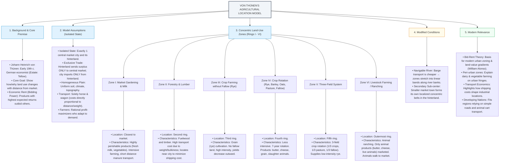

# Von Thünen's Agricultural Model - Visual Flowcharts

```mermaid
flowchart TD
    Title["VON THÜNEN'S AGRICULTURAL LOCATION MODEL"]
    Title --> Intro["1. Background & Core Premise"]
    Title --> Assump["2. Model Assumptions (Isolated State)"]
    Title --> Zones["3. Concentric Land-Use Zones (Rings I - VI)"]
    Title --> Mods["4. Modified Conditions"]
    Title --> Modern["5. Modern Relevance"]

    Intro --> Intro_Bullets["• Johann Heinrich von Thünen: Early 19th c. German economist (Estate: Tellow).<br>• Core Goal: Show how/why land use changes with distance from market.<br>• Economic Rent (Bidding Power): Products with highest expected returns outbid others."]

    Assump --> Assump_Bullets["• Isolated State: Exactly 1 central market city and its hinterland.<br>• Exclusive Trade: Hinterland sends surplus ONLY to central market; city imports ONLY from hinterland.<br>• Homogeneous Plain: Uniform soil, climate, topography.<br>• Transport: Solely horse & wagon (costs directly proportional to distance/weight).<br>• Farmers: Rational profit-maximizers who adapt to demand."]

    Zones --> Z1["Zone I: Market Gardening & Milk"]
    Zones --> Z2["Zone II: Forestry & Lumber"]
    Zones --> Z3["Zone III: Crop Farming without Fallow (Rye)"]
    Zones --> Z4["Zone IV: Crop Rotation (Rye, Barley, Oats, Pasture, Fallow)"]
    Zones --> Z5["Zone V: Three-Field System"]
    Zones --> Z6["Zone VI: Livestock Farming / Ranching"]

    Z1 --> Z1_Bullets["• Location: Closest to market.<br>• Characteristics: Highly perishable products (fresh milk, vegetables). Intensive farming, short distance manure transport."]
    Z2 --> Z2_Bullets["• Location: Second ring.<br>• Characteristics: Fuelwood and timber. High transport cost due to weight/bulkiness; locates near city to minimize shipping cost."]
    Z3 --> Z3_Bullets["• Location: Third ring.<br>• Characteristics: Grain (rye) cultivation. No fallow land, high intensity, yields decrease outward."]
    Z4 --> Z4_Bullets["• Location: Fourth ring.<br>• Characteristics: Less intensive. 7-year rotation. Products: butter, cheese, grain, slaughter animals."]
    Z5 --> Z5_Bullets["• Location: Fifth ring.<br>• Characteristics: 3-field crop rotation (1/3 crops, 1/3 pasture, 1/3 fallow). Supplies low-intensity rye."]
    Z6 --> Z6_Bullets["• Location: Outermost ring.<br>• Characteristics: Animal ranching. Only animal products (butter, cheese, live animals) marketed. Animals walk to market."]

    Mods --> Mods_Bullets["• Navigable River: Barge transport is cheaper → zones stretch into linear bands along river banks.<br>• Secondary Sub-center: Smaller market town forms its own localized concentric belts in the hinterland."]

    Modern --> Modern_Bullets["• Bid-Rent Theory: Basis for modern urban zoning & land-value gradients (William Alonso).<br>• Peri-urban zones: Explain dairy & vegetable farming on urban fringes.<br>• Transport Economics: Highlights how shipping costs shape industrial locations.<br>• Developing Nations: Fits regions relying on simple roads and animal cart transport."]

    style Title fill:#f1f5f9,stroke:#334155,stroke-width:2px
    style Intro fill:#e0f2fe,stroke:#0284c7,stroke-width:1px
    style Assump fill:#e0f2fe,stroke:#0284c7,stroke-width:1px
    style Zones fill:#e0f2fe,stroke:#0284c7,stroke-width:1px
    style Mods fill:#fffbeb,stroke:#d97706,stroke-width:1px
    style Modern fill:#f0fdf4,stroke:#16a34a,stroke-width:1px
```
