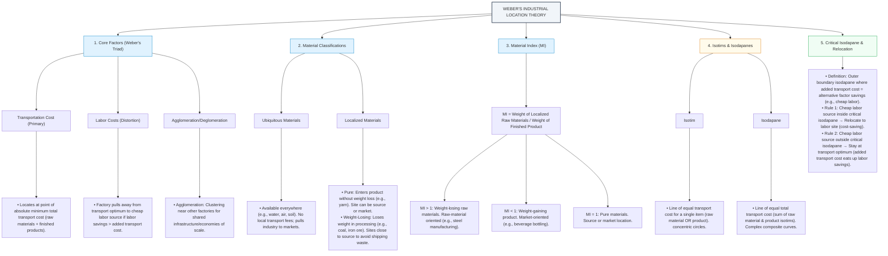

# Weber's Least Cost Location Theory - Visual Flowcharts

```mermaid
flowchart TD
    Title["WEBER'S INDUSTRIAL LOCATION THEORY"]
    Title --> Core["1. Core Factors (Weber's Triad)"]
    Title --> Material["2. Material Classifications"]
    Title --> MI["3. Material Index (MI)"]
    Title --> Lines["4. Isotims & Isodapanes"]
    Title --> Critical["5. Critical Isodapane & Relocation"]

    Core --> Core1["Transportation Cost (Primary)"]
    Core --> Core2["Labor Costs (Distortion)"]
    Core --> Core3["Agglomeration/Deglomeration"]

    Core1 --> C1_Bullets["• Locates at point of absolute minimum total transport cost (raw materials + finished products)."]
    Core2 --> C2_Bullets["• Factory pulls away from transport optimum to cheap labor source if labor savings > added transport cost."]
    Core3 --> C3_Bullets["• Agglomeration: Clustering near other factories for shared infrastructure/economies of scale.<br• Deglomeration: Dispersing when high land rent/congestion raise costs."]

    Material --> Mat_Ubi["Ubiquitous Materials"]
    Material --> Mat_Loc["Localized Materials"]

    Mat_Ubi --> Ubi_Bullets["• Available everywhere (e.g., water, air, soil). No local transport fees; pulls industry to markets."]
    Mat_Loc --> Loc_Bullets["• Pure: Enters product without weight loss (e.g., yarn). Site can be source or market.<br>• Weight-Losing: Loses weight in processing (e.g., coal, iron ore). Sites close to source to avoid shipping waste."]

    MI --> MI_Formula["MI = Weight of Localized Raw Materials / Weight of Finished Product"]
    MI_Formula --> MI_High["MI > 1: Weight-losing raw materials. Raw-material oriented (e.g., steel manufacturing)."]
    MI_Formula --> MI_Low["MI < 1: Weight-gaining product. Market-oriented (e.g., beverage bottling)."]
    MI_Formula --> MI_Equal["MI = 1: Pure materials. Source or market location."]

    Lines --> Isotim["Isotim"]
    Lines --> Isodapane["Isodapane"]

    Isotim --> Isotim_Bullets["• Line of equal transport cost for a single item (raw material OR product). concentric circles."]
    Isodapane --> Isodapane_Bullets["• Line of equal total transport cost (sum of raw material & product isotims). Complex composite curves."]

    Critical --> Crit_Bullets["• Definition: Outer boundary isodapane where added transport cost = alternative factor savings (e.g., cheap labor).<br>• Rule 1: Cheap labor source inside critical isodapane → Relocate to labor site (cost-saving).<br>• Rule 2: Cheap labor source outside critical isodapane → Stay at transport optimum (added transport cost eats up labor savings)."]

    style Title fill:#f1f5f9,stroke:#334155,stroke-width:2px
    style Core fill:#e0f2fe,stroke:#0284c7,stroke-width:1px
    style Material fill:#e0f2fe,stroke:#0284c7,stroke-width:1px
    style MI fill:#e0f2fe,stroke:#0284c7,stroke-width:1px
    style Lines fill:#fffbeb,stroke:#d97706,stroke-width:1px
    style Critical fill:#f0fdf4,stroke:#16a34a,stroke-width:1px
```
